# AuthKit Current-State Use Case Flows

This document diagrams the controller-layer endpoints currently implemented in AuthKit and the infrastructure each flow depends on. Diagrams use Mermaid sequence syntax so they can be rendered by GitHub, IDE plugins, or documentation tooling.

Source surface reviewed:

- `AuthController`: `/api/v1/auth/**`
- `UserController`: `/api/v1/users/me/**`
- `JwksController`: `/.well-known/jwks.json`
- Shared infrastructure: Kubernetes manifests, Spring Security filter chain, network/rate-limit filters, Redis token storage, Caffeine authority/rate-limit caches, PostgreSQL/Flyway schema, RabbitMQ email queue, Resend email provider, durable security/consent audit events, Prometheus metrics.

## Shared Infrastructure Path

Current request order in the codebase is:

1. External client reaches the edge reverse proxy or ingress controller.
2. Kubernetes `NetworkPolicy` only permits ingress-controller traffic to the AuthKit pods.
3. `OriginFirewallFilter` rejects direct backend access unless the remote source is trusted.
4. `RateLimitingFilter` resolves the real client IP, applies local Caffeine rate limiting first, then distributed Redis Bucket4j rate limiting.
5. `RequestBodySizeLimitFilter` rejects oversized POST/PUT/PATCH bodies before JSON parsing or password hashing.
6. Spring OAuth2 resource-server JWT validation runs for authenticated routes.
7. `WorkerAuthFilter` applies only to `/api/v1/internal/**`; no controller endpoint for that prefix currently exists in this repository.
8. `UserAuthoritiesFilter` refreshes authorities from a local Caffeine cache; on cache miss it loads the current user snapshot from PostgreSQL.
9. Controller/service logic executes.
10. Durable security events are written through a bounded async writer, with synchronous fallback when configured.
11. Metrics are exposed at `/actuator/prometheus`; alerts are defined in `k8s/06-prometheus-rules.yaml`.

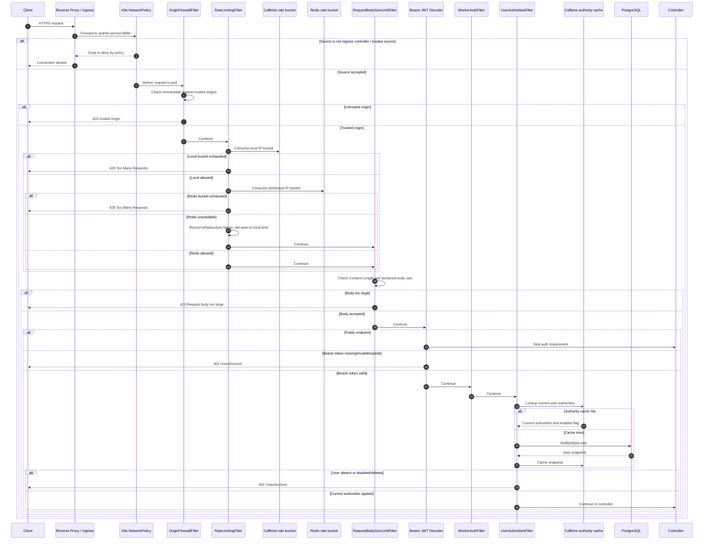

## Endpoint Summary

| Endpoint | Auth | Primary state | Key infrastructure |
|---|---:|---|---|
| `POST /api/v1/auth/login` | Public | PostgreSQL user, Redis refresh token or MFA challenge | Caffeine/Redis rate limits, Argon2 limiter, lockout Caffeine/Redis, MFA Redis challenge, audit DB |
| `POST /api/v1/auth/mfa/verify-login` | Public + MFA challenge | Redis MFA challenge, Redis refresh token | One-time MFA challenge consume, TOTP/backup code verification, audit DB |
| `POST /api/v1/auth/refresh` | Refresh cookie + CSRF | Redis refresh token family | CSRF double-submit cookie, Redis Lua rotation, audit DB |
| `POST /api/v1/auth/logout` | Refresh cookie + CSRF | Redis refresh token session | CSRF double-submit cookie, Redis revocation, audit DB |
| `POST /api/v1/auth/logout-all` | Bearer JWT + MFA if enabled | Redis all sessions | JWT validation, authority cache, MFA step-up, Redis revocation |
| `POST /api/v1/auth/register` | Public | PostgreSQL user, email outbox | Argon2, consent event DB, outbox, RabbitMQ, Resend |
| `POST /api/v1/auth/email-confirmation/confirm` | Public | PostgreSQL user token hash | Audit DB |
| `POST /api/v1/auth/password-recovery/request` | Public | Redis recovery token, email outbox | Stealth response, outbox, RabbitMQ, Resend, audit DB |
| `POST /api/v1/auth/password-recovery/reset` | Public | Redis recovery token, PostgreSQL password | Argon2 limiter, Redis session revoke, outbox, audit DB |
| `GET /api/v1/users/me` | Bearer JWT | PostgreSQL user | Authority Caffeine/DB cache, tenant check |
| `GET /api/v1/users/me/consent` | Bearer JWT | PostgreSQL user | Authority Caffeine/DB cache, tenant check |
| `POST /api/v1/users/me/export` | Bearer JWT + password step-up | PostgreSQL user, consent events, security events | Argon2 limiter, audit DB |
| `PATCH /api/v1/users/me` | Bearer JWT | PostgreSQL user | Authority Caffeine/DB cache, tenant check |
| `POST /api/v1/users/me/password` | Bearer JWT + current password + MFA if enabled | PostgreSQL password, Redis sessions | Argon2 limiter, lockout check, MFA step-up, audit DB |
| `GET /api/v1/users/me/sessions` | Bearer JWT | Redis refresh sessions | Authority Caffeine/DB cache |
| `GET /api/v1/users/me/mfa` | Bearer JWT | PostgreSQL MFA rows | Authority Caffeine/DB cache, tenant check |
| `POST /api/v1/users/me/mfa/totp/enroll` | Bearer JWT + current password | PostgreSQL pending encrypted TOTP secret | Argon2 limiter, encrypted secret storage, audit DB |
| `POST /api/v1/users/me/mfa/totp/confirm` | Bearer JWT + current password + TOTP | PostgreSQL active TOTP and backup codes, Redis sessions | TOTP verification, hashed backup codes, session revocation, audit DB |
| `DELETE /api/v1/users/me/mfa/totp` | Bearer JWT + current password + MFA | PostgreSQL disabled TOTP, Redis sessions | MFA step-up, backup-code cleanup, session revocation, audit DB |
| `POST /api/v1/users/me/mfa/backup-codes` | Bearer JWT + current password + MFA | PostgreSQL hashed backup codes | Atomic backup-code replacement, audit DB |
| `DELETE /api/v1/users/me/sessions/{jti}` | Bearer JWT + MFA if enabled | Redis refresh session | Lockout check, MFA step-up, audit DB |
| `DELETE /api/v1/users/me` | Bearer JWT + password step-up | PostgreSQL anonymized user, Redis sessions | Argon2 limiter, authority cache eviction, audit DB |
| `GET /.well-known/jwks.json` | Public | RSA public key config | Downstream stateless JWT verification |

## 1. Login

`POST /api/v1/auth/login`

Infrastructure role: edge and Kubernetes restrict entry; network filters rate-limit before hashing; `AccountLockoutService` uses Redis as the global lockout source when available and Caffeine as local fallback; Argon2 verification is bounded by `Argon2ConcurrencyLimiter`; accounts with MFA enabled receive only a short-lived one-time MFA challenge in Redis, not a refresh cookie; accounts without MFA receive a Redis-backed refresh token and stateless JWT; security events and Prometheus counters are emitted.

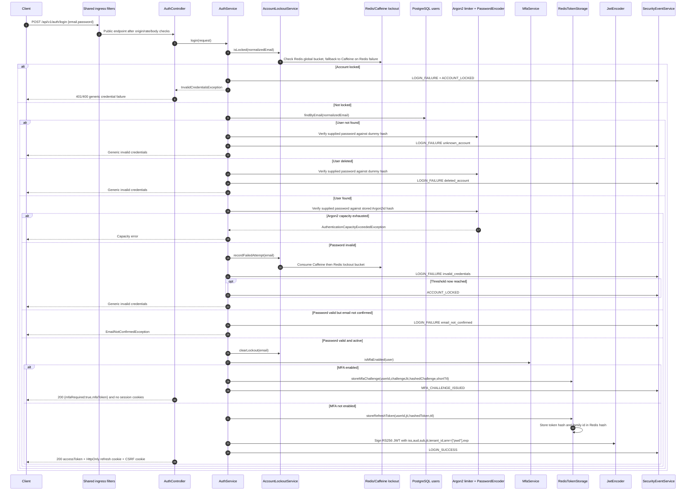

## 1A. Complete MFA Login

`POST /api/v1/auth/mfa/verify-login`

Infrastructure role: this is a public route because the user does not yet have a bearer token, but it requires the one-time MFA challenge issued after successful password verification. Redis consumes the challenge atomically before code verification so challenge replay fails closed. TOTP secrets are decrypted only in service memory; backup codes are compared as keyed hashes and consumed atomically in PostgreSQL. Successful verification is the point where refresh cookies and access JWTs are issued.

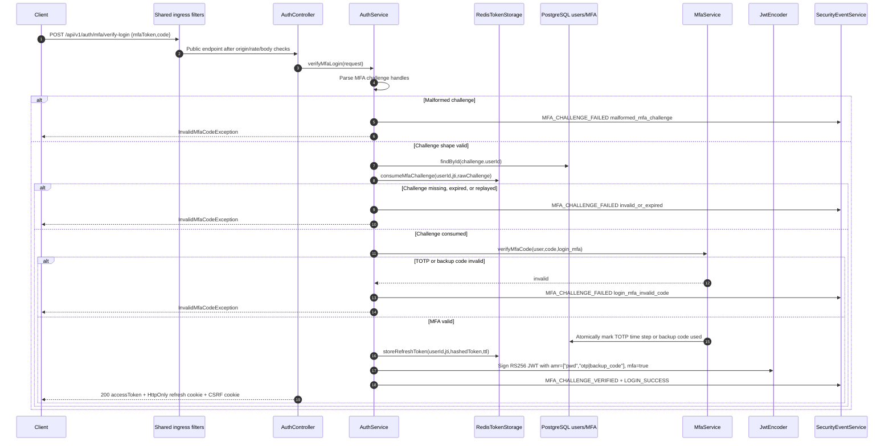

## 2. Refresh Token Rotation

`POST /api/v1/auth/refresh`

Infrastructure role: refresh is public at the route layer but requires a valid refresh cookie; CSRF is enforced through double-submit cookie/header before service logic; token rotation is atomic in Redis Lua; reuse detection revokes the refresh-token family and emits critical audit/alert signals.

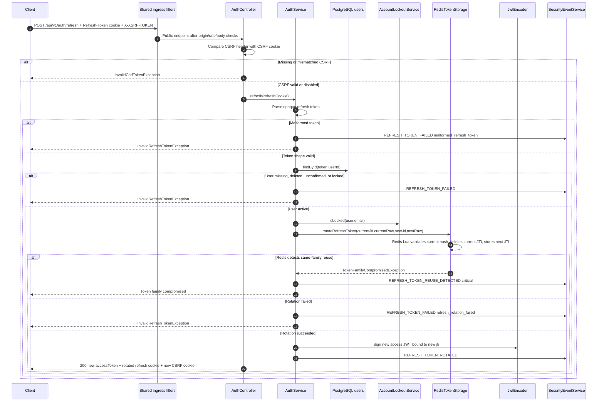

## 3. Logout Current Session

`POST /api/v1/auth/logout`

Infrastructure role: logout is route-public to allow client cleanup, but CSRF is enforced when a refresh cookie is present; Redis validates the refresh token before revoking so forged logout audit events are not created; invalid or missing tokens are treated as idempotent cleanup.

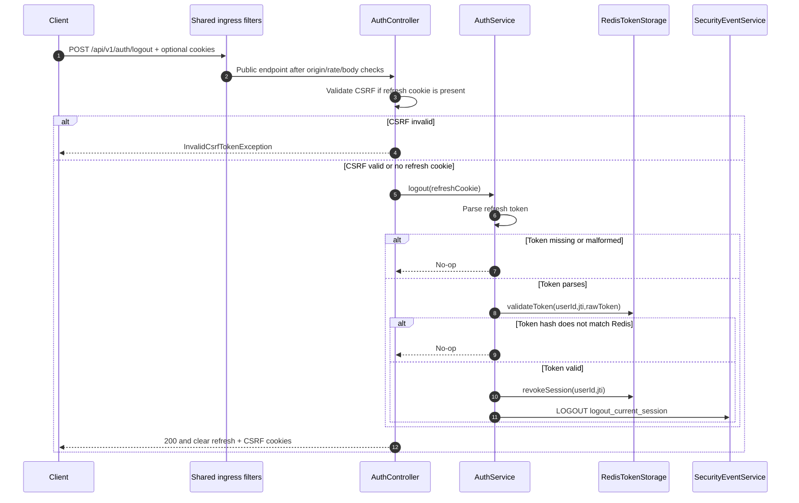

## 4. Logout All Sessions

`POST /api/v1/auth/logout-all`

Infrastructure role: this route requires a valid bearer access token; `UserAuthoritiesFilter` refreshes the live role/enabled snapshot from Caffeine or PostgreSQL before the controller executes; if MFA is enabled for the account the request must include a valid MFA proof; Redis deletes the entire refresh session hash for the user.

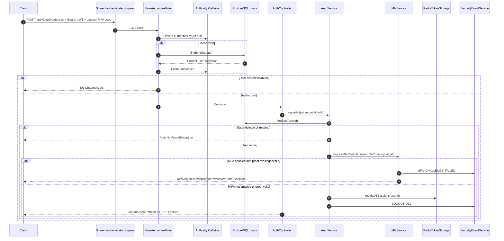

## 5. Register

`POST /api/v1/auth/register`

Infrastructure role: request size and rate limits are enforced before Argon2 hashing; user and consent state are stored transactionally in PostgreSQL; activation email is written to the email outbox and later delivered through RabbitMQ and Resend outside the request transaction; duplicate behavior depends on `authkit.auth.registration.stealth-conflicts`.

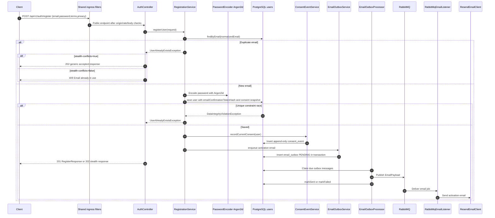

## 6. Confirm Email

`POST /api/v1/auth/email-confirmation/confirm?token=...`

Infrastructure role: confirmation is public but still passes origin and rate-limit filters; only token hashes are expected in persistent user records, with a raw-token lookup fallback for migration compatibility; success emits a durable security event.

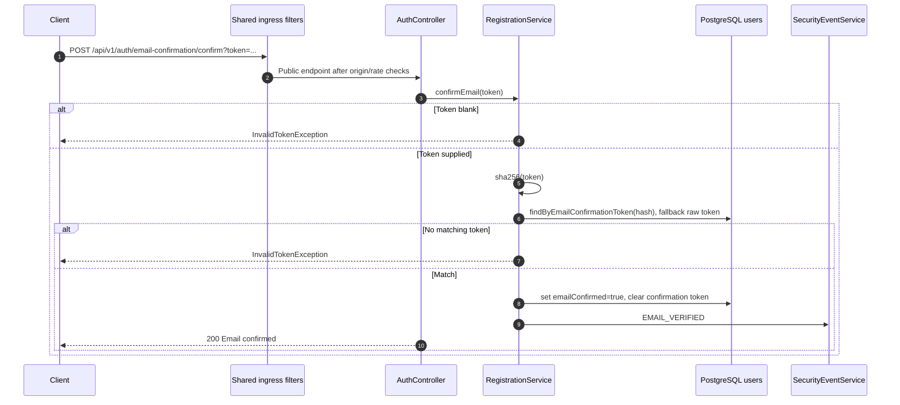

## 7. Request Password Recovery

`POST /api/v1/auth/password-recovery/request`

Infrastructure role: the endpoint intentionally returns the same success response for existing and non-existing accounts; existing accounts get a Redis recovery token and an outbox-backed email; unknown accounts still create a durable security event for abuse visibility.

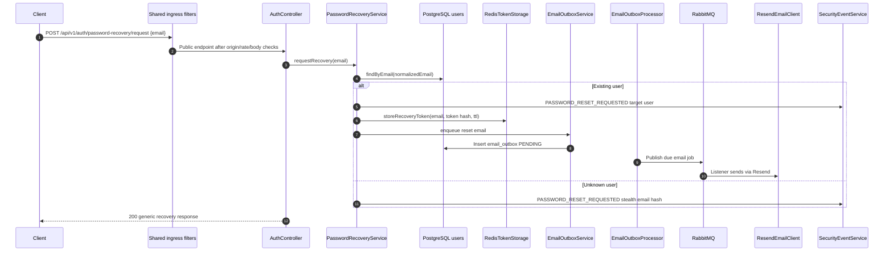

## 8. Reset Password

`POST /api/v1/auth/password-recovery/reset?email=...`

Infrastructure role: recovery tokens are consumed atomically from Redis before password mutation; Argon2 encoding is concurrency-bounded; all refresh sessions are revoked; a password-change notification is outbox-backed; audit and lockout state are updated.

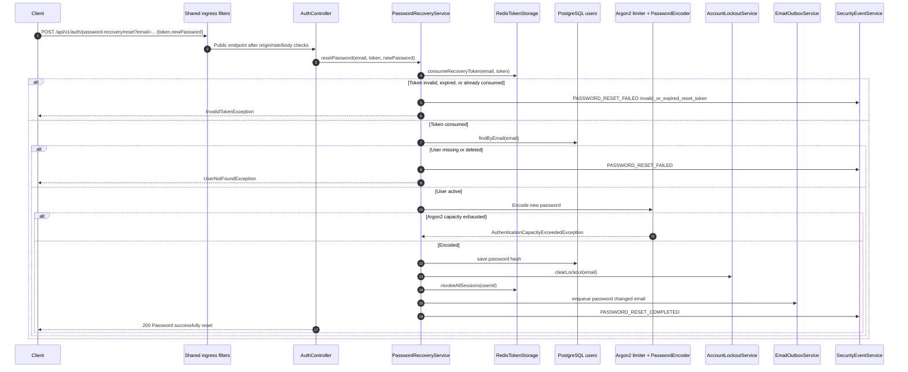

## 9. Get My Profile

`GET /api/v1/users/me`

Infrastructure role: JWT is stateless, but live account status and roles are rehydrated through `UserAuthoritiesFilter`; profile access also enforces tenant match against the JWT `tenant_id` claim and rejects deleted accounts.

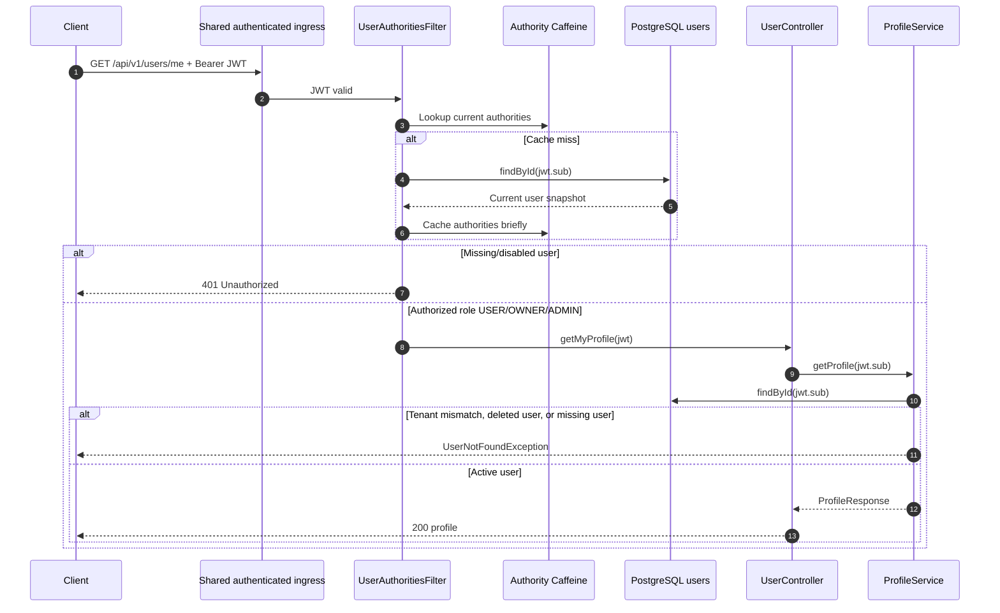

## 10. Get My Consent Snapshot

`GET /api/v1/users/me/consent`

Infrastructure role: shares the authenticated ingress path; the service loads the active user, enforces tenant and email-confirmed status, then returns the current consent snapshot stored on the user row.

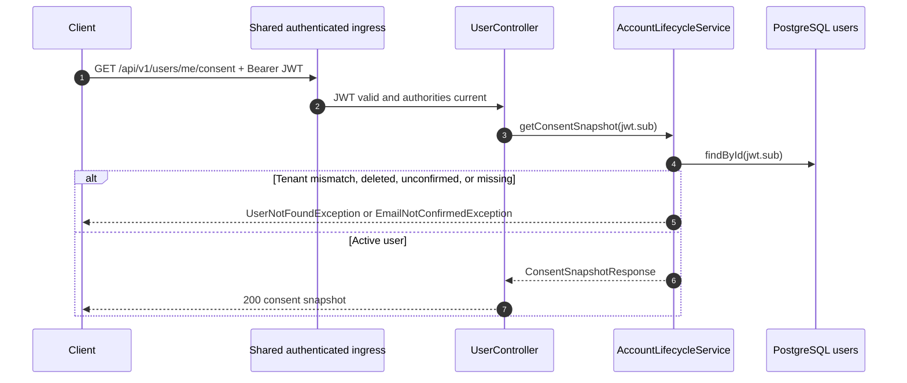

## 11. Export My Data

`POST /api/v1/users/me/export`

Infrastructure role: this is a sensitive authenticated operation with current-password step-up; Argon2 verification is bounded; response aggregates user profile, current consent, consent history, deletion metadata, and a bounded set of privacy-safe security events; export itself is audited.

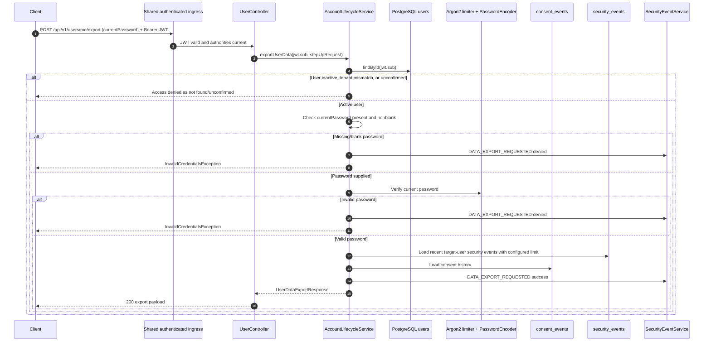

## 12. Update My Profile

`PATCH /api/v1/users/me`

Infrastructure role: the endpoint has no user-id path parameter, so it is scoped to the JWT subject; the service still performs a subject equality check, tenant check, deleted-account check, and email-confirmed check before saving whitelisted profile fields.

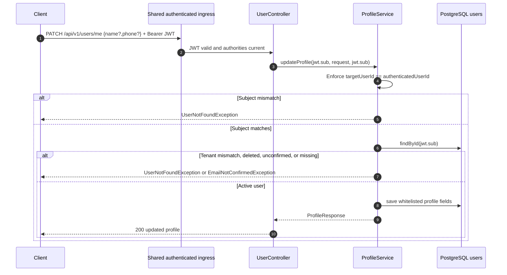

## 13. Change My Password

`POST /api/v1/users/me/password`

Infrastructure role: this is a sensitive authenticated operation; it is blocked while the account is locked, requires current-password verification, requires MFA proof when MFA is enabled for the account, bounds both Argon2 verification and encoding, revokes every Redis refresh session except the current access-token JTI, and emits high-severity security events.

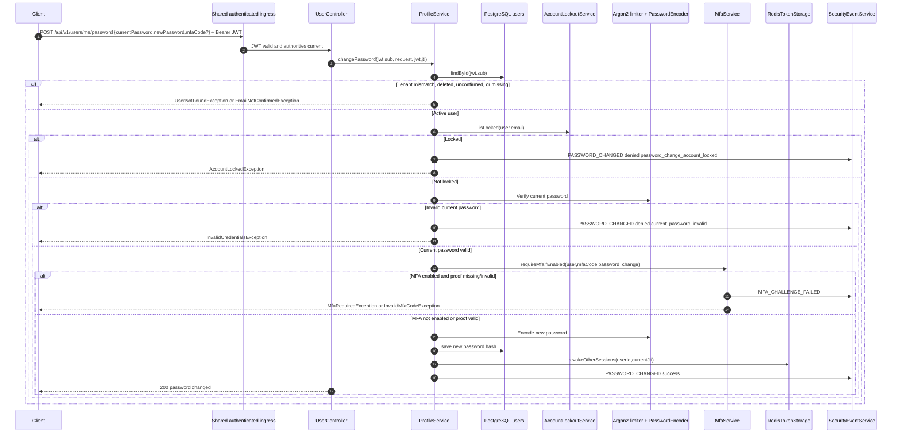

## 13A. MFA Management

`GET /api/v1/users/me/mfa`, `POST /api/v1/users/me/mfa/totp/enroll`, `POST /api/v1/users/me/mfa/totp/confirm`, `DELETE /api/v1/users/me/mfa/totp`, `POST /api/v1/users/me/mfa/backup-codes`

Infrastructure role: MFA management is bearer-authenticated and scoped to the JWT subject. Enrollment requires current-password step-up and replaces stale pending credentials. TOTP secrets are encrypted with AES-GCM before PostgreSQL persistence. Confirmation verifies a live TOTP code, generates one-time backup codes, stores only keyed hashes, revokes refresh sessions, and audits the change. Disabling MFA and regenerating backup codes require both current-password and MFA proof.

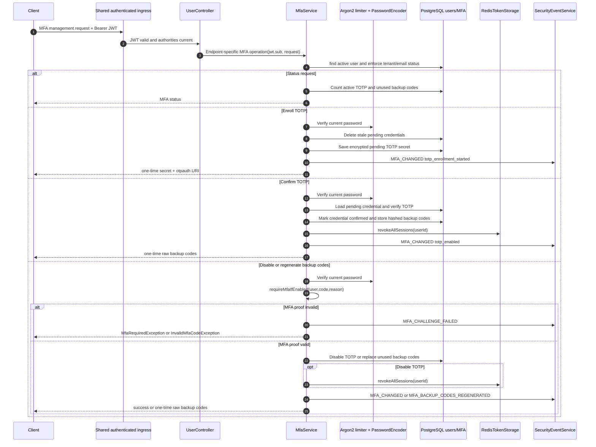

## 14. List My Sessions

`GET /api/v1/users/me/sessions`

Infrastructure role: the access token is stateless, but active refresh sessions are stateful and listed from Redis by JTI; user activity and tenant checks happen before exposing session identifiers.

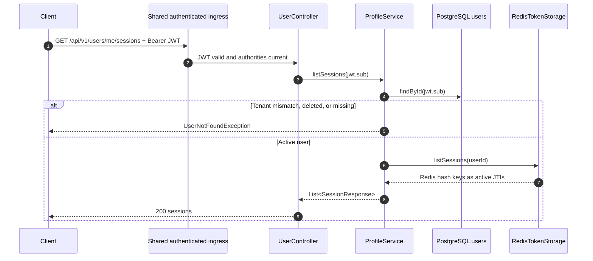

## 15. Revoke One Session

`DELETE /api/v1/users/me/sessions/{jti}`

Infrastructure role: revocation is scoped to the authenticated user's Redis refresh-token hash, which prevents cross-user session deletion; lockout blocks session management; MFA proof is required when enabled for the account; success is audited as logout/session revocation.

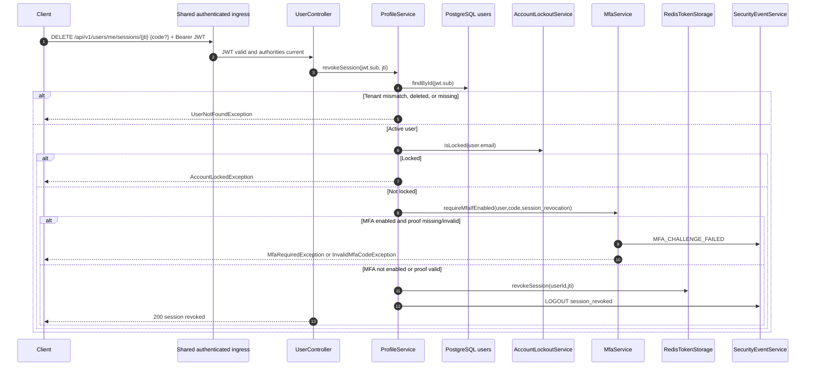

## 16. Delete My Account

`DELETE /api/v1/users/me`

Infrastructure role: deletion requires bearer auth and password step-up; user PII is anonymized immediately in PostgreSQL; authority cache is evicted and Redis sessions are revoked only after commit; deletion and anonymization are durable security events; retention jobs later purge deleted-account tombstones according to configuration.

```mermaid
sequenceDiagram
    autonumber
    participant C as Client
    participant I as Shared authenticated ingress
    participant UC as UserController
    participant ALS as AccountLifecycleService
    participant DB as PostgreSQL users
    participant ARG as Argon2 limiter + PasswordEncoder
    participant ACa as Authority Caffeine
    participant TS as RedisTokenStorage
    participant AUD as SecurityEventService
    participant MET as MeterRegistry

    C->>I: DELETE /api/v1/users/me {currentPassword} + Bearer JWT
    I->>UC: JWT valid and authorities current
    UC->>ALS: requestDeletion(jwt.sub, stepUpRequest)
    ALS->>DB: findById(jwt.sub)
    alt User inactive, tenant mismatch, or unconfirmed
        ALS-->>C: Access denied as not found/unconfirmed
    else Active user
        ALS->>ARG: Verify current password
        alt Missing/invalid password
            ALS->>AUD: ACCOUNT_DELETION_REQUESTED denied
            ALS-->>C: InvalidCredentialsException
        else Valid password
            ALS->>ARG: Encode random replacement password
            ALS->>DB: mark deletion requested, deleted, anonymized; replace direct PII
            ALS-->>UC: AccountDeletionResponse
            UC-->>C: 200 deleted
            ALS->>ACa: afterCommit evict user authorities
            ALS->>TS: afterCommit revokeAllSessions(userId)
            alt Redis revocation fails
                ALS->>MET: security.infrastructure.failure component=token_storage
            end
            ALS->>AUD: ACCOUNT_DELETION_REQUESTED success
            ALS->>AUD: ACCOUNT_ANONYMIZED success
        end
    end
```

## 17. Get JWKS

`GET /.well-known/jwks.json`

Infrastructure role: this public endpoint publishes the active RSA public key and key id so downstream services can validate AuthKit JWTs statelessly without calling AuthKit on every request.

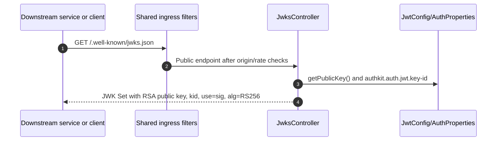

## 18. Background Email Delivery Flow

This flow is not a direct controller endpoint, but it is part of registration, password recovery, and password reset completion.

Infrastructure role: request handlers only enqueue messages in PostgreSQL; the scheduler claims due rows in batches and publishes them to RabbitMQ; the listener sends through Resend outside the user transaction. Publish failures update the outbox row and increment infrastructure-failure metrics.

```mermaid
sequenceDiagram
    autonumber
    participant S as Registration/Recovery service
    participant OB as EmailOutboxService
    participant DB as PostgreSQL email_outbox
    participant OP as EmailOutboxProcessor scheduler
    participant MQ as RabbitMQ exchange/queue
    participant EL as RabbitMqEmailListener
    participant EP as ResendEmailClient
    participant MET as MeterRegistry

    S->>OB: enqueue(EmailPayload)
    OB->>DB: Insert PENDING in same app transaction
    OP->>DB: claimDueMessages(batchSize, lockTtl)
    DB-->>OP: Mark claimable rows PROCESSING
    loop Each claimed message
        OP->>MQ: publish EmailPayload
        alt Rabbit publish succeeds
            OP->>DB: markSent(messageId)
            MQ->>EL: Deliver message
            EL->>EP: Send email
        else Rabbit publish fails
            OP->>MET: security.infrastructure.failure component=email_outbox
            OP->>DB: markFailed(messageId,error)
        end
    end
```

## 19. Background Retention Flow

This flow is not a direct controller endpoint, but it supports production privacy and audit retention requirements.

Infrastructure role: `DataRetentionService` runs from the configured cron when enabled; it purges expired security events and deleted-account tombstones in bounded batches with new transactions per batch to avoid long-running delete transactions.

```mermaid
sequenceDiagram
    autonumber
    participant SCH as Scheduler
    participant DRS as DataRetentionService
    participant SE as security_events
    participant DB as users

    SCH->>DRS: purgeExpiredSecurityEvents() on cron
    loop Bounded security-event batches
        DRS->>SE: findExpiredIds(cutoff, PageRequest(batchSize))
        alt No expired ids
            DRS-->>SCH: Done
        else Expired ids found
            DRS->>SE: purgeByIdIn(ids) in REQUIRES_NEW transaction
        end
    end
    loop Bounded deleted-user batches
        DRS->>DB: findDeletedIdsBefore(cutoff, PageRequest(batchSize))
        alt No expired tombstones
            DRS-->>SCH: Done
        else Expired tombstones found
            DRS->>DB: purgeDeletedByIdIn(ids) in REQUIRES_NEW transaction
        end
    end
```

## Production Readiness Note

The current architecture is intentionally stateless for access-token verification: issued access tokens are self-contained RS256 JWTs, downstream services can verify them using JWKS, and AuthKit does not create server-side HTTP sessions. The stateful parts are deliberate security state: refresh-token families, MFA login challenges, recovery tokens, distributed rate-limit buckets, lockout buckets, authority snapshots, encrypted TOTP credentials, hashed backup codes, email outbox rows, and durable audit/consent records.

Production strengths visible in the current implementation:

- Reverse-proxy trust boundary is enforced in Kubernetes and in application filters.
- Volumetric protection happens before JSON parsing and password hashing.
- Password hashing work is concurrency-bounded to reduce hashing DoS risk.
- Refresh tokens are HttpOnly cookies, server-side hashed in Redis, rotated atomically, and family reuse is audited as critical.
- MFA login challenges are one-time Redis entries; TOTP secrets are encrypted at rest; backup codes are stored as keyed hashes and consumed atomically.
- Authenticated routes rehydrate live authorities instead of trusting stale JWT roles indefinitely.
- Email delivery is outbox-backed and does not hold user transactions open while calling RabbitMQ or Resend.
- Security and consent events are durable, privacy-safe, metric-backed, and alertable.
- Account export/deletion require current-password step-up; password change, logout-all, session revocation, MFA disablement, and backup-code regeneration require MFA proof when MFA is enabled.

Operational caveats to keep in mind before production:

- Redis is a hard dependency for refresh tokens, recovery tokens, and MFA login challenges; rate limiting and lockout have local fallback, but token flows do not.
- The Kubernetes service is intended to sit behind an ingress controller; real client IP handling depends on trusted ingress/proxy headers and the configured `network.proxy-depth`.
- No frontend is included in this repository; browser storage, XSS controls, and redirect UX must be validated in the consuming application.
- `/actuator/prometheus` is intentionally public in the app security rules; production exposure should be constrained by Kubernetes network policy, ingress rules, or monitoring-network controls.
- NetworkPolicy cannot restrict Resend egress by FQDN; production clusters should use an egress gateway, DNS policy, or cloud firewall where available.
- Downstream services must validate JWT issuer, audience, expiration, signature, and `kid`, and should not call AuthKit per request unless they need a live revocation/authorization decision beyond token TTL.
- Passkeys/WebAuthn, OAuth2/OIDC provider or social-login relying-party capabilities, and the admin/policy plane remain future Phase 8 extensions; this branch implements the production-safe MFA baseline first.
