# AuthKit Current-State Use Case Flows

This document diagrams the controller-layer endpoints currently implemented in AuthKit and the infrastructure each flow depends on. Diagrams use Mermaid sequence syntax so they can be rendered by GitHub, IDE plugins, or documentation tooling.

Source surface reviewed:

- `AuthController`: `/api/v1/auth/**`
- `UserController`: `/api/v1/users/me/**`
- `OAuthController`: `/api/v1/oauth2/**`, `/oauth2/token`, `/oauth2/revoke`, `/oauth2/introspect`, `/oauth2/userinfo`, `/.well-known/openid-configuration`
- `AdminController`: `/api/v1/admin/**`
- `JwksController`: `/.well-known/jwks.json`
- Shared infrastructure: Kubernetes manifests, Spring Security filter chain (CORS, security headers), network/rate-limit filters, `AbuseThrottleService` (endpoint filter + service-layer account/email/tenant/client dimensions), Redis token storage and session binding, Caffeine authority/MFA-status/rate-limit caches, JWT key rotation and revocation validators, PostgreSQL/Flyway schema, email outbox with queue or direct dispatch, configurable email provider, durable security/consent audit events, WebAuthn relying-party validation, OAuth2 authorization-code storage, Prometheus metrics.

## Shared Infrastructure Path

Current request order in the codebase is:

1. External client reaches the edge reverse proxy or ingress controller.
2. Kubernetes `NetworkPolicy` only permits ingress-controller traffic to the AuthKit pods.
3. `OriginFirewallFilter` rejects direct backend access unless the remote source is trusted.
4. `RateLimitingFilter` resolves the real client IP, applies local Caffeine rate limiting first, then distributed Redis Bucket4j rate limiting.
5. `EndpointAbuseRateLimitingFilter` applies route-specific IP and device/user-agent throttles through `AbuseThrottleService` (local bucket first, then Redis when available). Redis loss normally uses stricter local limits; optional `AUTH_ABUSE_FAIL_CLOSED_HIGH_RISK=true` returns an opaque 503 for login, MFA login verification, registration, recovery/reset, and OAuth token exchange.
6. `RequestBodySizeLimitFilter` rejects oversized POST/PUT/PATCH bodies before JSON parsing or password hashing.
7. Spring Security CORS applies explicit allowed origins from `authkit.auth.cors` when enabled (production rejects wildcard-with-credentials and non-HTTPS origins).
8. Spring OAuth2 resource-server JWT validation runs for authenticated routes: RS256 signature via JWKS, issuer and `AUTH_JWT_AUDIENCE` checks, `token_use=first_party_access`, revoked signing `kid` rejection, and revoked token `jti` lookup (`OAuthTokenRevocationService`). OAuth access and ID tokens are rejected before session or authority lookup.
9. `WorkerAuthFilter` applies to `/api/v1/internal/**` and `/actuator/prometheus`; it requires a trusted network source plus the current or previous internal worker token.
10. `UserAuthoritiesFilter` enforces **first-party API session binding**: for bearer requests it requires JWT `jti` to match an active refresh session in Redis (`TokenStorage.isSessionActive`), then refreshes authorities from a local Caffeine cache (on miss, loads the user snapshot from PostgreSQL). Inactive sessions, missing `jti`, disabled users, or stale roles yield 401.
11. Controller/service logic executes; many flows apply additional `AbuseThrottleService` checks (per-email, per-user, per-tenant, per-client) beyond the endpoint filter.
12. Critical security events (lockout creation, admin mutation, refresh-family reuse, TOTP disablement, deletion/anonymization) are synchronously flushed in the business transaction; failure returns opaque 503 and rolls back transactional mutations. Noncritical events use the bounded asynchronous writer and emit `security.audit.dropped` plus `SECURITY_ALERT` without failing user operations.
13. Metrics are exposed at `/actuator/prometheus` only when the internal worker token is supplied; alerts are defined in `k8s/06-prometheus-rules.yaml`.

In the per-endpoint diagrams below, **Shared authenticated ingress** (or **Shared ingress filters** on public routes) refers to this path. Diagrams abbreviate it as “JWT valid with active session and current authorities” unless a flow adds extra checks.

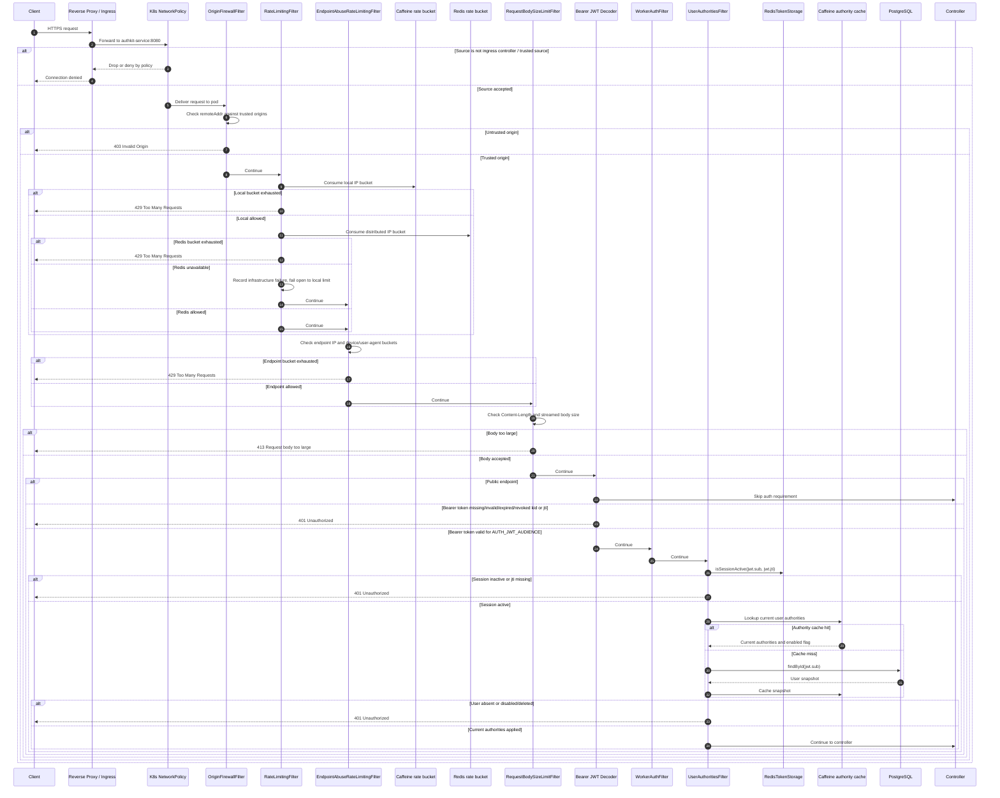
```mermaid
sequenceDiagram
    autonumber
    participant C as Client
    participant RP as Reverse Proxy / Ingress
    participant NP as K8s NetworkPolicy
    participant OF as OriginFirewallFilter
    participant RL as RateLimitingFilter
    participant AR as EndpointAbuseRateLimitingFilter
    participant LC as Caffeine rate bucket
    participant RR as Redis rate bucket
    participant BL as RequestBodySizeLimitFilter
    participant JWT as Bearer JWT Decoder
    participant WF as WorkerAuthFilter
    participant AF as UserAuthoritiesFilter
    participant TS as RedisTokenStorage
    participant AC as Caffeine authority cache
    participant DB as PostgreSQL
    participant CT as Controller

    C->>RP: HTTPS request
    RP->>NP: Forward to authkit-service:8080
    alt Source is not ingress controller / trusted source
        NP-->>RP: Drop or deny by policy
        RP-->>C: Connection denied
    else Source accepted
        NP->>OF: Deliver request to pod
        OF->>OF: Check remoteAddr against trusted origins
        alt Untrusted origin
            OF-->>C: 403 Invalid Origin
        else Trusted origin
            OF->>RL: Continue
            RL->>LC: Consume local IP bucket
            alt Local bucket exhausted
                RL-->>C: 429 Too Many Requests
            else Local allowed
                RL->>RR: Consume distributed IP bucket
                alt Redis bucket exhausted
                    RL-->>C: 429 Too Many Requests
                else Redis unavailable
                    RL->>RL: Record infrastructure failure, fail open to local limit
                    RL->>AR: Continue
                else Redis allowed
                    RL->>AR: Continue
                end
            end
            AR->>AR: Check endpoint IP and device/user-agent buckets
            alt Endpoint bucket exhausted
                AR-->>C: 429 Too Many Requests
            else Endpoint allowed
                AR->>BL: Continue
            end
            BL->>BL: Check Content-Length and streamed body size
            alt Body too large
                BL-->>C: 413 Request body too large
            else Body accepted
                BL->>JWT: Continue
                alt Public endpoint
                    JWT->>CT: Skip auth requirement
                else Bearer token missing/invalid/expired/revoked kid or jti
                    JWT-->>C: 401 Unauthorized
                else Bearer token valid for AUTH_JWT_AUDIENCE
                    JWT->>WF: Continue
                    WF->>AF: Continue
                    AF->>TS: isSessionActive(jwt.sub, jwt.jti)
                    alt Session inactive or jti missing
                        AF-->>C: 401 Unauthorized
                    else Session active
                        AF->>AC: Lookup current user authorities
                        alt Authority cache hit
                            AC-->>AF: Current authorities and enabled flag
                        else Cache miss
                            AF->>DB: findById(jwt.sub)
                            DB-->>AF: User snapshot
                            AF->>AC: Cache snapshot
                        end
                        alt User absent or disabled/deleted
                            AF-->>C: 401 Unauthorized
                        else Current authorities applied
                            AF->>CT: Continue to controller
                        end
                    end
                end
            end
        end
    end
```

## Access Token Classes

| Token | `token_use` | Typical `aud` | Session in Redis | Use on AuthKit |
|---|---|---|---|
| First-party access (login, refresh, passkey, MFA login) | `first_party_access` | `AUTH_JWT_AUDIENCE` | Yes — JWT `jti` equals refresh-session JTI | `/api/v1/users/**`, `/api/v1/admin/**`, `/api/v1/oauth2/authorize` |
| OAuth access (authorization code grant) | `oauth_access` | OAuth `client_id` | No — independent `jti`; revocation via `OAuthTokenRevocationService` | `/oauth2/userinfo`, introspection, and revocation; **not** first-party user/admin APIs |
| OAuth ID token | `id_token` | `client_id` | N/A | Returned to client apps; never accepted as an API bearer token |

Downstream resource servers should validate issuer, audience, `kid`, algorithm, expiry, tenant, and scopes from JWKS without calling AuthKit on every request unless live revocation beyond token TTL is required.

## Endpoint Summary

Authenticated first-party routes depend on JWT validation **and** `UserAuthoritiesFilter` session binding. Many write flows also call `AbuseThrottleService` for account/email/tenant/client dimensions in addition to `EndpointAbuseRateLimitingFilter`.

| Endpoint | Auth | Primary state | Key infrastructure |
|---|---:|---|---|
| `POST /api/v1/auth/login` | Public | PostgreSQL user, Redis refresh token or MFA challenge | Endpoint/account throttles, Argon2 limiter, lockout Caffeine/Redis, MFA Redis challenge, audit DB |
| `POST /api/v1/auth/mfa/verify-login` | Public + MFA challenge | Redis MFA challenge, Redis refresh token | Endpoint/user throttles, one-time MFA challenge consume, TOTP/backup code verification, audit DB |
| `POST /api/v1/auth/passkeys/options` | Public | PostgreSQL passkey challenge | Endpoint/email throttles, WebAuthn assertion options, DB challenge state, audit DB |
| `POST /api/v1/auth/passkeys/verify` | Public + passkey assertion | PostgreSQL passkey credential/challenge, Redis refresh token | Endpoint/email throttles, Yubico WebAuthn assertion verification, signature counter update, JWT/cookies |
| `POST /api/v1/auth/refresh` | Refresh cookie + CSRF | Redis refresh token family | Endpoint throttles, CSRF double-submit cookie, Redis Lua rotation, audit DB |
| `POST /api/v1/auth/logout` | Refresh cookie + CSRF | Redis refresh token session | CSRF double-submit cookie, Redis revocation, audit DB |
| `POST /api/v1/auth/logout-all` | Bearer JWT + MFA if enabled | Redis all sessions | JWT + Redis session `jti`, authority cache, MFA step-up, Redis revocation |
| `POST /api/v1/auth/register` | Public | PostgreSQL user, email outbox | Endpoint/email throttles, password policy/history, Argon2, consent event DB, outbox, email dispatch/provider |
| `POST /api/v1/auth/email-confirmation/confirm` | Public | PostgreSQL user token hash | Audit DB |
| `POST /api/v1/auth/email-confirmation/resend` | Public | PostgreSQL user token hash, email outbox | Endpoint/email cooldown and daily caps, token rotation, outbox |
| `POST /api/v1/auth/password-recovery/request` | Public | Redis recovery token, email outbox | Stealth response, endpoint/email cooldown and daily caps, outbox, email dispatch/provider, audit DB |
| `POST /api/v1/auth/password-recovery/reset` | Public | Redis recovery token, PostgreSQL password | Endpoint/email throttles, password policy/history, Argon2 limiter, Redis session revoke, outbox, audit DB |
| `GET /api/v1/users/me` | Bearer JWT | PostgreSQL user | JWT + Redis session `jti`, authority cache, tenant check |
| `GET /api/v1/users/me/consent` | Bearer JWT | PostgreSQL user | JWT + Redis session `jti`, authority cache, tenant check |
| `POST /api/v1/users/me/export` | Bearer JWT + password step-up + MFA if enabled | PostgreSQL user, consent events, security events | JWT + session `jti`, Argon2 limiter, MFA step-up, audit DB |
| `PATCH /api/v1/users/me` | Bearer JWT | PostgreSQL user | JWT + session `jti`, user write throttle, authority cache, tenant check |
| `POST /api/v1/users/me/password` | Bearer JWT + current password + MFA if enabled | PostgreSQL password, Redis sessions | JWT + session `jti`, user write throttle, password policy/history, Argon2 limiter, lockout check, MFA step-up, audit DB |
| `GET /api/v1/users/me/sessions?limit=50&cursor=...` | Bearer JWT | Redis refresh sessions and cursor state | JWT + session `jti`, per-user throttle, bounded Redis `HSCAN`, single-use user-bound cursor with five-minute TTL |
| `GET /api/v1/users/me/mfa` | Bearer JWT | PostgreSQL MFA rows | JWT + session `jti`, authority cache, MFA status cache, tenant check |
| `POST /api/v1/users/me/mfa/totp/enroll` | Bearer JWT + current password | PostgreSQL pending encrypted TOTP secret | MFA change throttle, Argon2 limiter, encrypted secret storage, audit DB |
| `POST /api/v1/users/me/mfa/totp/confirm` | Bearer JWT + current password + TOTP | PostgreSQL active TOTP and backup codes, Redis sessions | MFA change throttle, TOTP verification, hashed backup codes, session revocation, audit DB |
| `DELETE /api/v1/users/me/mfa/totp` | Bearer JWT + current password + MFA | PostgreSQL disabled TOTP, Redis sessions | MFA change throttle, MFA step-up, backup-code cleanup, session revocation, audit DB |
| `POST /api/v1/users/me/mfa/backup-codes` | Bearer JWT + current password + MFA | PostgreSQL hashed backup codes | MFA change throttle, atomic backup-code replacement, audit DB |
| `GET /api/v1/users/me/passkeys` | Bearer JWT | PostgreSQL passkey credentials | Authority Caffeine/DB cache, tenant check |
| `POST /api/v1/users/me/passkeys/options` | Bearer JWT + current password + MFA if enabled | PostgreSQL passkey challenge | Passkey change throttle, Argon2 limiter, MFA step-up, WebAuthn registration options, DB challenge state, audit DB |
| `POST /api/v1/users/me/passkeys` | Bearer JWT + WebAuthn challenge | PostgreSQL passkey credential | Yubico registration verification, public key storage, audit DB |
| `DELETE /api/v1/users/me/passkeys/{credentialId}` | Bearer JWT + current password + MFA if enabled | PostgreSQL passkey credential | Passkey change throttle, Argon2 limiter, MFA step-up, credential disablement, audit DB |
| `DELETE /api/v1/users/me/sessions/{jti}` | Bearer JWT + MFA if enabled | Redis refresh session | Lockout check, MFA step-up, audit DB |
| `DELETE /api/v1/users/me` | Bearer JWT + password step-up + MFA if enabled | PostgreSQL anonymized user, Redis sessions | Account deletion throttle, Argon2 limiter, MFA step-up, authority cache eviction, audit DB |
| `POST /api/v1/oauth2/authorize` | First-party Bearer JWT + consent | PostgreSQL OAuth consent and authorization code | JWT + session `jti`, endpoint/client throttles, PKCE S256, consent persistence, audit DB |
| `POST /oauth2/token` | Public + client/PKCE proof | PostgreSQL OAuth authorization code | Endpoint/client throttles, one-time code consume, RS256 access/ID token (`aud`=client_id), audit DB |
| `POST /oauth2/revoke` | Public + client proof | Redis/Caffeine revoked OAuth `jti` | Client throttles, JWT decode, revoked-JTI TTL |
| `POST /oauth2/introspect` | Public + confidential client proof | JWT and revocation state | Client throttles, active token response |
| `GET /oauth2/userinfo` | Bearer OAuth access token (permitAll route) | JWT claims | Service-side OAuth JWT decode (not first-party session binding), `openid` scope, scope-filtered claims |
| `GET /.well-known/openid-configuration` | Public | AuthProperties | OIDC discovery metadata |
| `GET /api/v1/admin/users` | ADMIN bearer JWT | PostgreSQL users | JWT + session `jti`, `ROLE_ADMIN`, authority cache |
| `PATCH /api/v1/admin/users/{userId}/role` | ADMIN bearer JWT + MFA if enabled | PostgreSQL user role | JWT + session `jti`, MFA step-up, last-admin guard, audit DB |
| `GET /api/v1/admin/tenants` | ADMIN bearer JWT | PostgreSQL users | JWT + session `jti`, tenant inventory |
| `GET/POST/PATCH/DELETE /api/v1/admin/oauth-clients/**` | ADMIN bearer JWT + MFA for writes | PostgreSQL OAuth clients | JWT + session `jti`, admin/tenant throttles, client secret one-time return and rotation, audit DB |
| `GET /.well-known/jwks.json` | Public | RSA public key config | Active and retiring public keys, revoked key IDs hidden |

## 1. Login

`POST /api/v1/auth/login`

Infrastructure role: edge and Kubernetes restrict entry; network filters rate-limit before hashing; `AccountLockoutService` uses Redis as the global lockout source when available and Caffeine as local fallback; Argon2 verification is bounded by `Argon2ConcurrencyLimiter`; accounts with MFA enabled receive only a short-lived one-time MFA challenge in Redis, not a refresh cookie; accounts without MFA receive a Redis-backed refresh token and a self-contained RS256 access JWT whose `jti` is bound to that refresh session for later first-party API calls; security events and Prometheus counters are emitted.

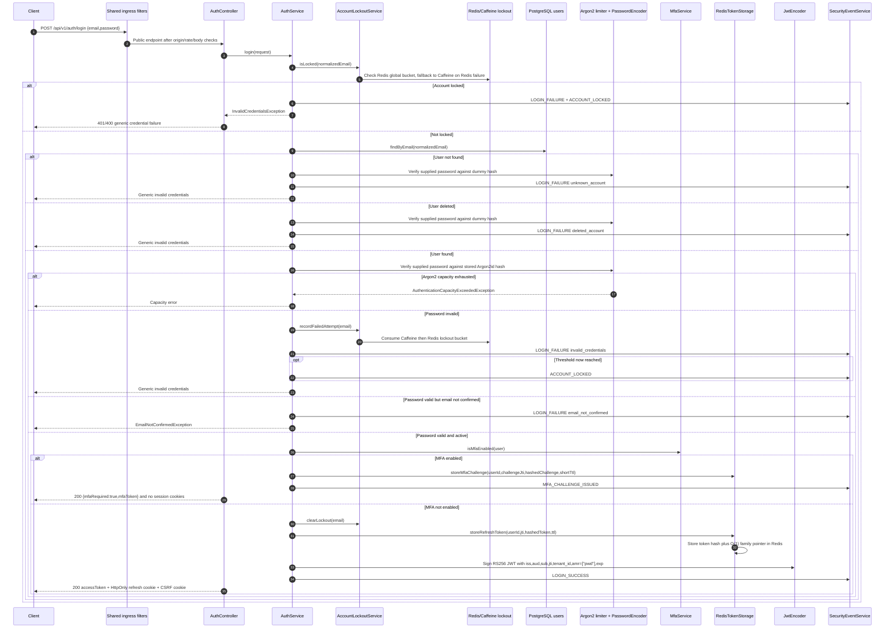
```mermaid
sequenceDiagram
    autonumber
    participant C as Client
    participant I as Shared ingress filters
    participant AC as AuthController
    participant AS as AuthService
    participant LS as AccountLockoutService
    participant LK as Redis/Caffeine lockout
    participant DB as PostgreSQL users
    participant ARG as Argon2 limiter + PasswordEncoder
    participant MFA as MfaService
    participant TS as RedisTokenStorage
    participant JWT as JwtEncoder
    participant AUD as SecurityEventService

    C->>I: POST /api/v1/auth/login {email,password}
    I->>AC: Public endpoint after origin/rate/body checks
    AC->>AS: login(request)
    AS->>LS: isLocked(normalizedEmail)
    LS->>LK: Check Redis global bucket, fallback to Caffeine on Redis failure
    alt Account locked
        AS->>AUD: LOGIN_FAILURE + ACCOUNT_LOCKED
        AS-->>AC: InvalidCredentialsException
        AC-->>C: 401/400 generic credential failure
    else Not locked
        AS->>DB: findByEmail(normalizedEmail)
        alt User not found
            AS->>ARG: Verify supplied password against dummy hash
            AS->>AUD: LOGIN_FAILURE unknown_account
            AS-->>C: Generic invalid credentials
        else User deleted
            AS->>ARG: Verify supplied password against dummy hash
            AS->>AUD: LOGIN_FAILURE deleted_account
            AS-->>C: Generic invalid credentials
        else User found
            AS->>ARG: Verify supplied password against stored Argon2id hash
            alt Argon2 capacity exhausted
                ARG-->>AS: AuthenticationCapacityExceededException
                AS-->>C: Capacity error
            else Password invalid
                AS->>LS: recordFailedAttempt(email)
                LS->>LK: Consume Caffeine then Redis lockout bucket
                AS->>AUD: LOGIN_FAILURE invalid_credentials
                opt Threshold now reached
                    AS->>AUD: ACCOUNT_LOCKED
                end
                AS-->>C: Generic invalid credentials
            else Password valid but email not confirmed
                AS->>AUD: LOGIN_FAILURE email_not_confirmed
                AS-->>C: EmailNotConfirmedException
            else Password valid and active
                AS->>MFA: isMfaEnabled(user)
                alt MFA enabled
                    AS->>TS: storeMfaChallenge(userId,challengeJti,hashedChallenge,shortTtl)
                    AS->>AUD: MFA_CHALLENGE_ISSUED
                    AC-->>C: 200 {mfaRequired:true,mfaToken} and no session cookies
                else MFA not enabled
                    AS->>LS: clearLockout(email)
                    AS->>TS: storeRefreshToken(userId,jti,hashedToken,ttl)
                    TS->>TS: Store token hash plus O(1) family pointer in Redis
                    AS->>JWT: Sign RS256 JWT with iss,aud,sub,jti,tenant_id,amr=["pwd"],exp
                    AS->>AUD: LOGIN_SUCCESS
                    AC-->>C: 200 accessToken + HttpOnly refresh cookie + CSRF cookie
                end
            end
        end
    end
```

## 1A. Complete MFA Login

`POST /api/v1/auth/mfa/verify-login`

Infrastructure role: this is a public route because the user does not yet have a bearer token, but it requires the one-time MFA challenge issued after successful password verification. Redis consumes the challenge atomically before code verification so challenge replay fails closed. TOTP secrets are decrypted only in service memory; backup codes are compared as keyed hashes and consumed atomically in PostgreSQL. Invalid MFA codes feed the same account lockout pressure as bad passwords; successful verification is the point where lockout is cleared and refresh cookies/access JWTs are issued.

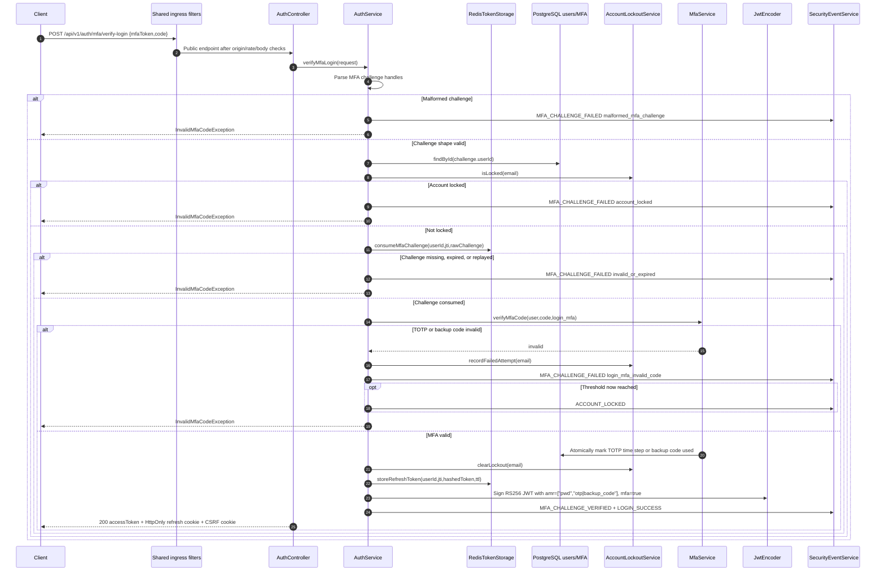
```mermaid
sequenceDiagram
    autonumber
    participant C as Client
    participant I as Shared ingress filters
    participant AC as AuthController
    participant AS as AuthService
    participant TS as RedisTokenStorage
    participant DB as PostgreSQL users/MFA
    participant LS as AccountLockoutService
    participant MFA as MfaService
    participant JWT as JwtEncoder
    participant AUD as SecurityEventService

    C->>I: POST /api/v1/auth/mfa/verify-login {mfaToken,code}
    I->>AC: Public endpoint after origin/rate/body checks
    AC->>AS: verifyMfaLogin(request)
    AS->>AS: Parse MFA challenge handles
    alt Malformed challenge
        AS->>AUD: MFA_CHALLENGE_FAILED malformed_mfa_challenge
        AS-->>C: InvalidMfaCodeException
    else Challenge shape valid
        AS->>DB: findById(challenge.userId)
        AS->>LS: isLocked(email)
        alt Account locked
            AS->>AUD: MFA_CHALLENGE_FAILED account_locked
            AS-->>C: InvalidMfaCodeException
        else Not locked
            AS->>TS: consumeMfaChallenge(userId,jti,rawChallenge)
            alt Challenge missing, expired, or replayed
                AS->>AUD: MFA_CHALLENGE_FAILED invalid_or_expired
                AS-->>C: InvalidMfaCodeException
            else Challenge consumed
                AS->>MFA: verifyMfaCode(user,code,login_mfa)
                alt TOTP or backup code invalid
                    MFA-->>AS: invalid
                    AS->>LS: recordFailedAttempt(email)
                    AS->>AUD: MFA_CHALLENGE_FAILED login_mfa_invalid_code
                    opt Threshold now reached
                        AS->>AUD: ACCOUNT_LOCKED
                    end
                    AS-->>C: InvalidMfaCodeException
                else MFA valid
                    MFA->>DB: Atomically mark TOTP time step or backup code used
                    AS->>LS: clearLockout(email)
                    AS->>TS: storeRefreshToken(userId,jti,hashedToken,ttl)
                    AS->>JWT: Sign RS256 JWT with amr=["pwd","otp|backup_code"], mfa=true
                    AS->>AUD: MFA_CHALLENGE_VERIFIED + LOGIN_SUCCESS
                    AC-->>C: 200 accessToken + HttpOnly refresh cookie + CSRF cookie
                end
            end
        end
    end
```

## 2. Refresh Token Rotation

`POST /api/v1/auth/refresh`

Infrastructure role: refresh is public at the route layer but requires a valid refresh cookie; CSRF is enforced through double-submit cookie/header before service logic; token rotation is atomic in Redis Lua; refresh-token family pointers allow O(1) reuse detection and family revocation without scanning every session for the user. The newly issued access JWT uses the **new** refresh-session `jti`, so the previous access token stops working on first-party APIs once rotation succeeds.

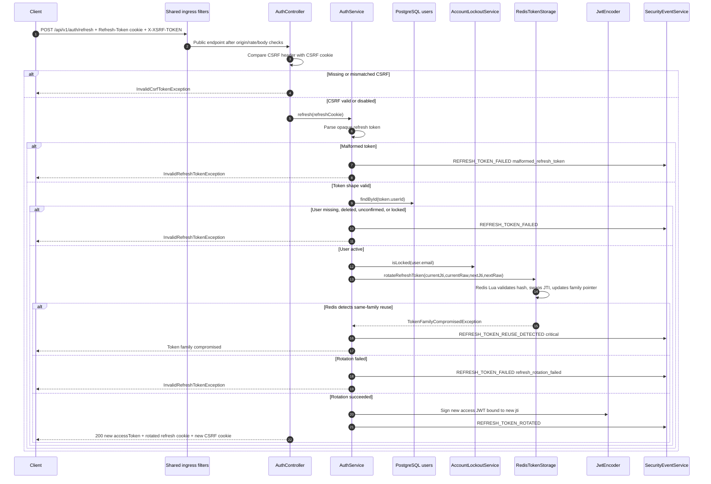
```mermaid
sequenceDiagram
    autonumber
    participant C as Client
    participant I as Shared ingress filters
    participant AC as AuthController
    participant AS as AuthService
    participant DB as PostgreSQL users
    participant LS as AccountLockoutService
    participant TS as RedisTokenStorage
    participant JWT as JwtEncoder
    participant AUD as SecurityEventService

    C->>I: POST /api/v1/auth/refresh + Refresh-Token cookie + X-XSRF-TOKEN
    I->>AC: Public endpoint after origin/rate/body checks
    AC->>AC: Compare CSRF header with CSRF cookie
    alt Missing or mismatched CSRF
        AC-->>C: InvalidCsrfTokenException
    else CSRF valid or disabled
        AC->>AS: refresh(refreshCookie)
        AS->>AS: Parse opaque refresh token
        alt Malformed token
            AS->>AUD: REFRESH_TOKEN_FAILED malformed_refresh_token
            AS-->>C: InvalidRefreshTokenException
        else Token shape valid
            AS->>DB: findById(token.userId)
            alt User missing, deleted, unconfirmed, or locked
                AS->>AUD: REFRESH_TOKEN_FAILED
                AS-->>C: InvalidRefreshTokenException
            else User active
                AS->>LS: isLocked(user.email)
                AS->>TS: rotateRefreshToken(currentJti,currentRaw,nextJti,nextRaw)
                TS->>TS: Redis Lua validates hash, swaps JTI, updates family pointer
                alt Redis detects same-family reuse
                    TS-->>AS: TokenFamilyCompromisedException
                    AS->>AUD: REFRESH_TOKEN_REUSE_DETECTED critical
                    AS-->>C: Token family compromised
                else Rotation failed
                    AS->>AUD: REFRESH_TOKEN_FAILED refresh_rotation_failed
                    AS-->>C: InvalidRefreshTokenException
                else Rotation succeeded
                    AS->>JWT: Sign new access JWT bound to new jti
                    AS->>AUD: REFRESH_TOKEN_ROTATED
                    AC-->>C: 200 new accessToken + rotated refresh cookie + new CSRF cookie
                end
            end
        end
    end
```

## 3. Logout Current Session

`POST /api/v1/auth/logout`

Infrastructure role: logout is route-public to allow client cleanup, but CSRF is enforced when a refresh cookie is present; Redis validates the refresh token before revoking so forged logout audit events are not created; invalid or missing tokens are treated as idempotent cleanup.

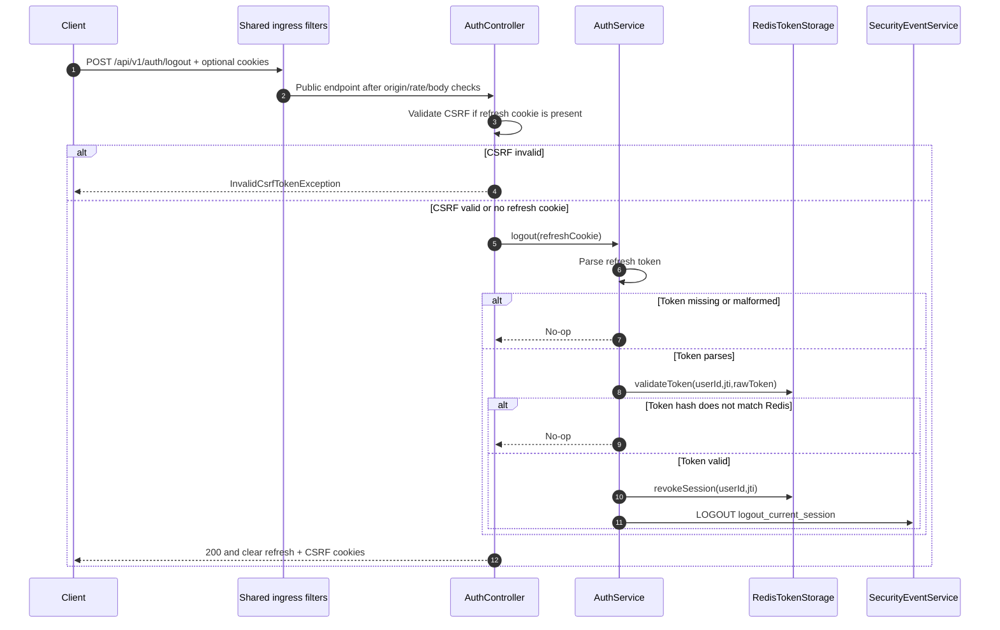
```mermaid
sequenceDiagram
    autonumber
    participant C as Client
    participant I as Shared ingress filters
    participant AC as AuthController
    participant AS as AuthService
    participant TS as RedisTokenStorage
    participant AUD as SecurityEventService

    C->>I: POST /api/v1/auth/logout + optional cookies
    I->>AC: Public endpoint after origin/rate/body checks
    AC->>AC: Validate CSRF if refresh cookie is present
    alt CSRF invalid
        AC-->>C: InvalidCsrfTokenException
    else CSRF valid or no refresh cookie
        AC->>AS: logout(refreshCookie)
        AS->>AS: Parse refresh token
        alt Token missing or malformed
            AS-->>AC: No-op
        else Token parses
            AS->>TS: validateToken(userId,jti,rawToken)
            alt Token hash does not match Redis
                AS-->>AC: No-op
            else Token valid
                AS->>TS: revokeSession(userId,jti)
                AS->>AUD: LOGOUT logout_current_session
            end
        end
        AC-->>C: 200 and clear refresh + CSRF cookies
    end
```

## 4. Logout All Sessions

`POST /api/v1/auth/logout-all`

Infrastructure role: this route requires a valid first-party bearer access token with an active Redis refresh session (`UserAuthoritiesFilter` checks `jwt.jti` before refreshing roles from Caffeine or PostgreSQL); if MFA is enabled for the account the request must include a valid MFA proof; Redis deletes the entire refresh session hash for the user, which immediately invalidates all bound access tokens.

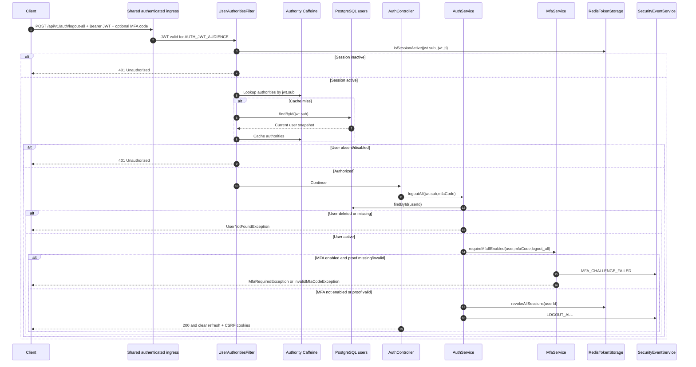
```mermaid
sequenceDiagram
    autonumber
    participant C as Client
    participant I as Shared authenticated ingress
    participant AF as UserAuthoritiesFilter
    participant ACa as Authority Caffeine
    participant DB as PostgreSQL users
    participant AC as AuthController
    participant AS as AuthService
    participant MFA as MfaService
    participant TS as RedisTokenStorage
    participant AUD as SecurityEventService

    C->>I: POST /api/v1/auth/logout-all + Bearer JWT + optional MFA code
    I->>AF: JWT valid for AUTH_JWT_AUDIENCE
    AF->>TS: isSessionActive(jwt.sub, jwt.jti)
    alt Session inactive
        AF-->>C: 401 Unauthorized
    else Session active
        AF->>ACa: Lookup authorities by jwt.sub
        alt Cache miss
            AF->>DB: findById(jwt.sub)
            DB-->>AF: Current user snapshot
            AF->>ACa: Cache authorities
        end
        alt User absent/disabled
            AF-->>C: 401 Unauthorized
        else Authorized
            AF->>AC: Continue
            AC->>AS: logoutAll(jwt.sub,mfaCode)
            AS->>DB: findById(userId)
            alt User deleted or missing
                AS-->>C: UserNotFoundException
            else User active
                AS->>MFA: requireMfaIfEnabled(user,mfaCode,logout_all)
                alt MFA enabled and proof missing/invalid
                    MFA->>AUD: MFA_CHALLENGE_FAILED
                    MFA-->>C: MfaRequiredException or InvalidMfaCodeException
                else MFA not enabled or proof valid
                    AS->>TS: revokeAllSessions(userId)
                    AS->>AUD: LOGOUT_ALL
                    AC-->>C: 200 and clear refresh + CSRF cookies
                end
            end
        end
    end
```

## 5. Register

`POST /api/v1/auth/register`

Infrastructure role: request size and rate limits are enforced before Argon2 hashing; password composition/history checks optionally query HIBP through k-anonymity (only the five-character SHA-1 prefix, padded response, bounded cache, timeout fail-open metric); user and consent state are stored transactionally in PostgreSQL; activation email is written to the email outbox and later delivered outside the request transaction; duplicate behavior depends on `authkit.auth.registration.stealth-conflicts`.

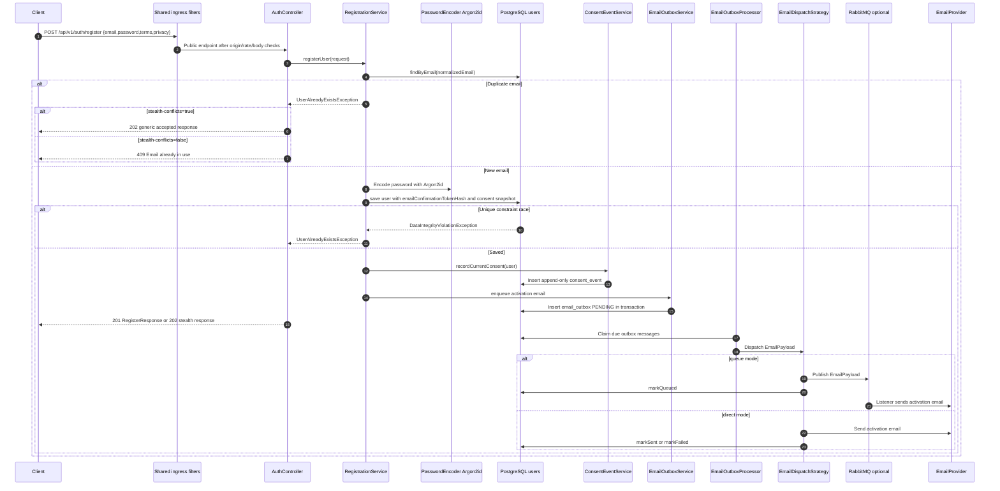
```mermaid
sequenceDiagram
    autonumber
    participant C as Client
    participant I as Shared ingress filters
    participant AC as AuthController
    participant RS as RegistrationService
    participant ARG as PasswordEncoder Argon2id
    participant DB as PostgreSQL users
    participant CE as ConsentEventService
    participant OB as EmailOutboxService
    participant OP as EmailOutboxProcessor
    participant DS as EmailDispatchStrategy
    participant MQ as RabbitMQ optional
    participant EP as EmailProvider

    C->>I: POST /api/v1/auth/register {email,password,terms,privacy}
    I->>AC: Public endpoint after origin/rate/body checks
    AC->>RS: registerUser(request)
    RS->>DB: findByEmail(normalizedEmail)
    alt Duplicate email
        RS-->>AC: UserAlreadyExistsException
        alt stealth-conflicts=true
            AC-->>C: 202 generic accepted response
        else stealth-conflicts=false
            AC-->>C: 409 Email already in use
        end
    else New email
        RS->>ARG: Encode password with Argon2id
        RS->>DB: save user with emailConfirmationTokenHash and consent snapshot
        alt Unique constraint race
            DB-->>RS: DataIntegrityViolationException
            RS-->>AC: UserAlreadyExistsException
        else Saved
            RS->>CE: recordCurrentConsent(user)
            CE->>DB: Insert append-only consent_event
            RS->>OB: enqueue activation email
            OB->>DB: Insert email_outbox PENDING in transaction
            AC-->>C: 201 RegisterResponse or 202 stealth response
            OP->>DB: Claim due outbox messages
            OP->>DS: Dispatch EmailPayload
            alt queue mode
                DS->>MQ: Publish EmailPayload
                DS->>DB: markQueued
                MQ->>EP: Listener sends activation email
            else direct mode
                DS->>EP: Send activation email
                DS->>DB: markSent or markFailed
            end
        end
    end
```

## 6. Confirm Email

`POST /api/v1/auth/email-confirmation/confirm?token=...`

Infrastructure role: confirmation is public but still passes origin and rate-limit filters; only token hashes are expected in persistent user records, with a raw-token lookup fallback for migration compatibility; success emits a durable security event.

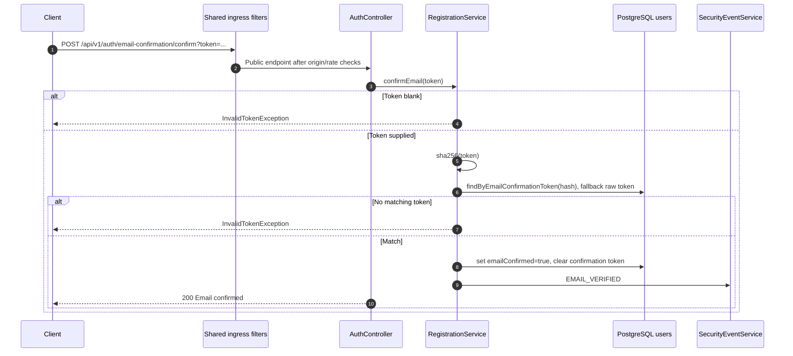
```mermaid
sequenceDiagram
    autonumber
    participant C as Client
    participant I as Shared ingress filters
    participant AC as AuthController
    participant RS as RegistrationService
    participant DB as PostgreSQL users
    participant AUD as SecurityEventService

    C->>I: POST /api/v1/auth/email-confirmation/confirm?token=...
    I->>AC: Public endpoint after origin/rate checks
    AC->>RS: confirmEmail(token)
    alt Token blank
        RS-->>C: InvalidTokenException
    else Token supplied
        RS->>RS: sha256(token)
        RS->>DB: findByEmailConfirmationToken(hash), fallback raw token
        alt No matching token
            RS-->>C: InvalidTokenException
        else Match
            RS->>DB: set emailConfirmed=true, clear confirmation token
            RS->>AUD: EMAIL_VERIFIED
            AC-->>C: 200 Email confirmed
        end
    end
```

## 7. Request Password Recovery

`POST /api/v1/auth/password-recovery/request`

Infrastructure role: the endpoint intentionally returns the same success response for existing and non-existing accounts; existing accounts get a Redis recovery token and an outbox-backed email; unknown accounts still create a durable security event for abuse visibility. Endpoint, IP, and per-email cooldown/daily throttles apply before token creation.

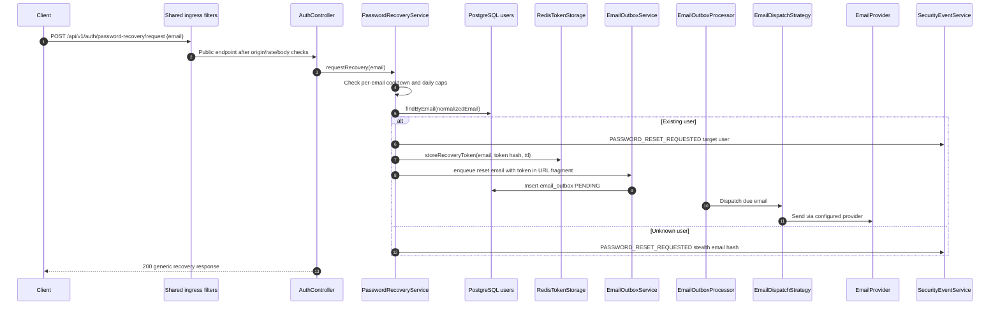
```mermaid
sequenceDiagram
    autonumber
    participant C as Client
    participant I as Shared ingress filters
    participant AC as AuthController
    participant PR as PasswordRecoveryService
    participant DB as PostgreSQL users
    participant TS as RedisTokenStorage
    participant OB as EmailOutboxService
    participant OP as EmailOutboxProcessor
    participant DS as EmailDispatchStrategy
    participant EP as EmailProvider
    participant AUD as SecurityEventService

    C->>I: POST /api/v1/auth/password-recovery/request {email}
    I->>AC: Public endpoint after origin/rate/body checks
    AC->>PR: requestRecovery(email)
    PR->>PR: Check per-email cooldown and daily caps
    PR->>DB: findByEmail(normalizedEmail)
    alt Existing user
        PR->>AUD: PASSWORD_RESET_REQUESTED target user
        PR->>TS: storeRecoveryToken(email, token hash, ttl)
        PR->>OB: enqueue reset email with token in URL fragment
        OB->>DB: Insert email_outbox PENDING
        OP->>DS: Dispatch due email
        DS->>EP: Send via configured provider
    else Unknown user
        PR->>AUD: PASSWORD_RESET_REQUESTED stealth email hash
    end
    AC-->>C: 200 generic recovery response
```

## 8. Reset Password

`POST /api/v1/auth/password-recovery/reset?email=...`

Infrastructure role: recovery email links carry token material in the URL fragment, not the query string, so browsers do not send the token to the backend as a referrer during normal navigation. The reset API receives the token in the request body. Recovery tokens are consumed atomically from Redis before password mutation; password policy rejects weak, identity-derived, common, breached (when HIBP is enabled), current, and recent-history passwords; Argon2 encoding is concurrency-bounded; all refresh sessions are revoked; a password-change notification is outbox-backed; audit and lockout state are updated. The app also emits `Referrer-Policy: no-referrer`.

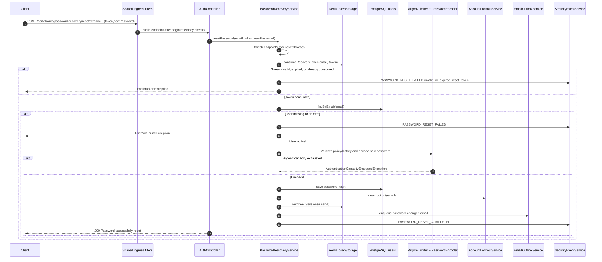
```mermaid
sequenceDiagram
    autonumber
    participant C as Client
    participant I as Shared ingress filters
    participant AC as AuthController
    participant PR as PasswordRecoveryService
    participant TS as RedisTokenStorage
    participant DB as PostgreSQL users
    participant ARG as Argon2 limiter + PasswordEncoder
    participant LS as AccountLockoutService
    participant OB as EmailOutboxService
    participant AUD as SecurityEventService

    C->>I: POST /api/v1/auth/password-recovery/reset?email=... {token,newPassword}
    I->>AC: Public endpoint after origin/rate/body checks
    AC->>PR: resetPassword(email, token, newPassword)
    PR->>PR: Check endpoint/email reset throttles
    PR->>TS: consumeRecoveryToken(email, token)
    alt Token invalid, expired, or already consumed
        PR->>AUD: PASSWORD_RESET_FAILED invalid_or_expired_reset_token
        PR-->>C: InvalidTokenException
    else Token consumed
        PR->>DB: findByEmail(email)
        alt User missing or deleted
            PR->>AUD: PASSWORD_RESET_FAILED
            PR-->>C: UserNotFoundException
        else User active
            PR->>ARG: Validate policy/history and encode new password
            alt Argon2 capacity exhausted
                ARG-->>PR: AuthenticationCapacityExceededException
            else Encoded
                PR->>DB: save password hash
                PR->>LS: clearLockout(email)
                PR->>TS: revokeAllSessions(userId)
                PR->>OB: enqueue password changed email
                PR->>AUD: PASSWORD_RESET_COMPLETED
                AC-->>C: 200 Password successfully reset
            end
        end
    end
```

## 9. Get My Profile

`GET /api/v1/users/me`

Infrastructure role: first-party JWT must pass resource-server validation and prove an active Redis refresh session via `jwt.jti` before `UserAuthoritiesFilter` rehydrates roles; profile access also enforces tenant match against the JWT `tenant_id` claim and rejects deleted accounts.

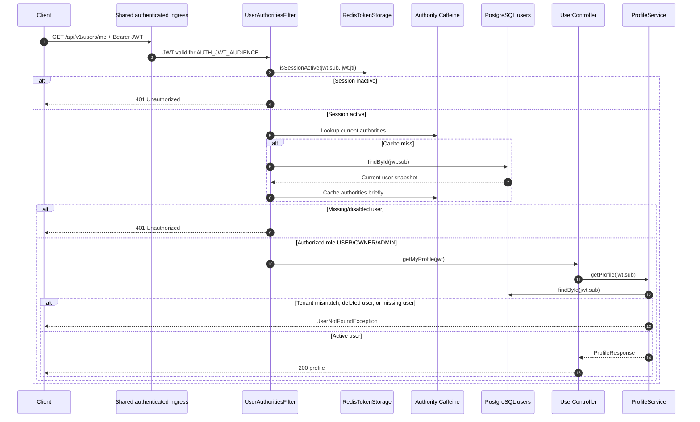
```mermaid
sequenceDiagram
    autonumber
    participant C as Client
    participant I as Shared authenticated ingress
    participant AF as UserAuthoritiesFilter
    participant TS as RedisTokenStorage
    participant ACa as Authority Caffeine
    participant DB as PostgreSQL users
    participant UC as UserController
    participant PS as ProfileService

    C->>I: GET /api/v1/users/me + Bearer JWT
    I->>AF: JWT valid for AUTH_JWT_AUDIENCE
    AF->>TS: isSessionActive(jwt.sub, jwt.jti)
    alt Session inactive
        AF-->>C: 401 Unauthorized
    else Session active
        AF->>ACa: Lookup current authorities
        alt Cache miss
            AF->>DB: findById(jwt.sub)
            DB-->>AF: Current user snapshot
            AF->>ACa: Cache authorities briefly
        end
        alt Missing/disabled user
            AF-->>C: 401 Unauthorized
        else Authorized role USER/OWNER/ADMIN
            AF->>UC: getMyProfile(jwt)
            UC->>PS: getProfile(jwt.sub)
            PS->>DB: findById(jwt.sub)
            alt Tenant mismatch, deleted user, or missing user
                PS-->>C: UserNotFoundException
            else Active user
                PS-->>UC: ProfileResponse
                UC-->>C: 200 profile
            end
        end
    end
```

## 10. Get My Consent Snapshot

`GET /api/v1/users/me/consent`

Infrastructure role: shares the authenticated ingress path; the service loads the active user, enforces tenant and email-confirmed status, then returns the current consent snapshot stored on the user row.

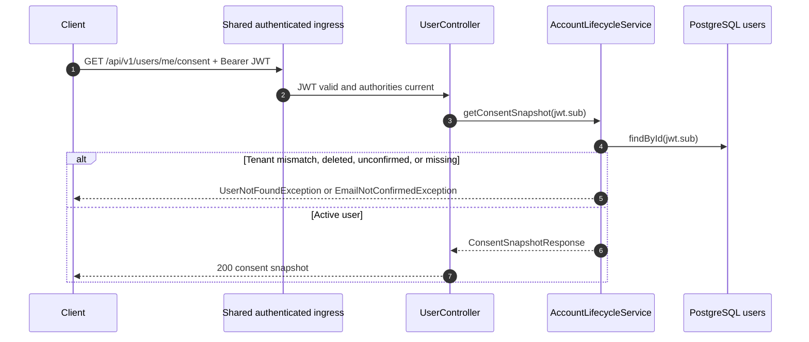
```mermaid
sequenceDiagram
    autonumber
    participant C as Client
    participant I as Shared authenticated ingress
    participant UC as UserController
    participant ALS as AccountLifecycleService
    participant DB as PostgreSQL users

    C->>I: GET /api/v1/users/me/consent + Bearer JWT
    I->>UC: JWT valid and authorities current
    UC->>ALS: getConsentSnapshot(jwt.sub)
    ALS->>DB: findById(jwt.sub)
    alt Tenant mismatch, deleted, unconfirmed, or missing
        ALS-->>C: UserNotFoundException or EmailNotConfirmedException
    else Active user
        ALS-->>UC: ConsentSnapshotResponse
        UC-->>C: 200 consent snapshot
    end
```

## 11. Export My Data

`POST /api/v1/users/me/export`

Infrastructure role: this is a sensitive authenticated operation with current-password step-up and MFA proof when MFA is enabled; Argon2 verification is bounded; response aggregates user profile, current consent, consent history, deletion metadata, and a bounded set of privacy-safe security events; export itself is audited.

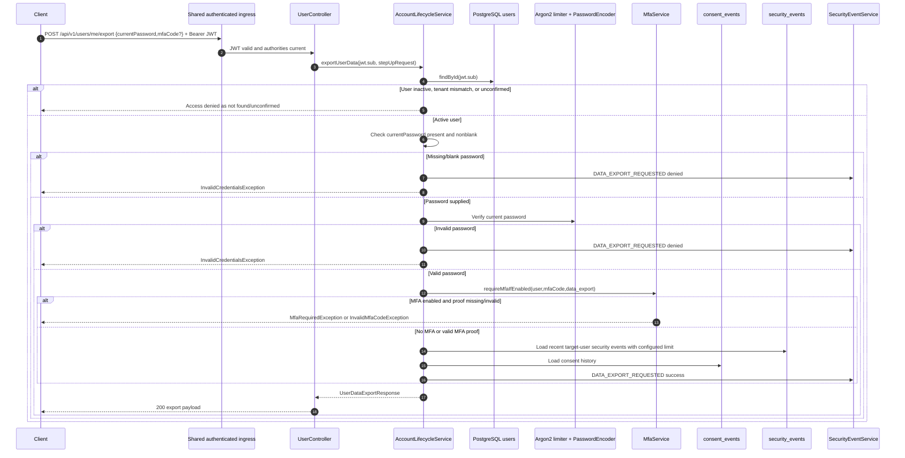
```mermaid
sequenceDiagram
    autonumber
    participant C as Client
    participant I as Shared authenticated ingress
    participant UC as UserController
    participant ALS as AccountLifecycleService
    participant DB as PostgreSQL users
    participant ARG as Argon2 limiter + PasswordEncoder
    participant MFA as MfaService
    participant CE as consent_events
    participant SE as security_events
    participant AUD as SecurityEventService

    C->>I: POST /api/v1/users/me/export {currentPassword,mfaCode?} + Bearer JWT
    I->>UC: JWT valid and authorities current
    UC->>ALS: exportUserData(jwt.sub, stepUpRequest)
    ALS->>DB: findById(jwt.sub)
    alt User inactive, tenant mismatch, or unconfirmed
        ALS-->>C: Access denied as not found/unconfirmed
    else Active user
        ALS->>ALS: Check currentPassword present and nonblank
        alt Missing/blank password
            ALS->>AUD: DATA_EXPORT_REQUESTED denied
            ALS-->>C: InvalidCredentialsException
        else Password supplied
            ALS->>ARG: Verify current password
            alt Invalid password
                ALS->>AUD: DATA_EXPORT_REQUESTED denied
                ALS-->>C: InvalidCredentialsException
            else Valid password
                ALS->>MFA: requireMfaIfEnabled(user,mfaCode,data_export)
                alt MFA enabled and proof missing/invalid
                    MFA-->>C: MfaRequiredException or InvalidMfaCodeException
                else No MFA or valid MFA proof
                    ALS->>SE: Load recent target-user security events with configured limit
                    ALS->>CE: Load consent history
                    ALS->>AUD: DATA_EXPORT_REQUESTED success
                end
                ALS-->>UC: UserDataExportResponse
                UC-->>C: 200 export payload
            end
        end
    end
```

## 12. Update My Profile

`PATCH /api/v1/users/me`

Infrastructure role: the endpoint has no user-id path parameter, so it is scoped to the JWT subject; the service still performs a subject equality check, tenant check, deleted-account check, and email-confirmed check before saving whitelisted profile fields.

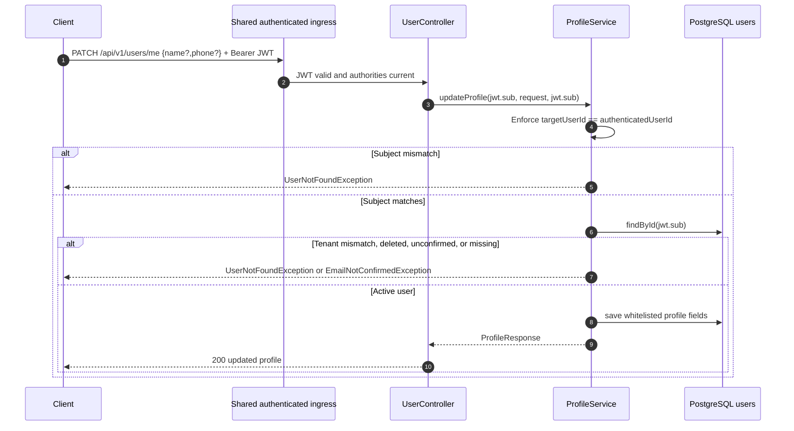
```mermaid
sequenceDiagram
    autonumber
    participant C as Client
    participant I as Shared authenticated ingress
    participant UC as UserController
    participant PS as ProfileService
    participant DB as PostgreSQL users

    C->>I: PATCH /api/v1/users/me {name?,phone?} + Bearer JWT
    I->>UC: JWT valid and authorities current
    UC->>PS: updateProfile(jwt.sub, request, jwt.sub)
    PS->>PS: Enforce targetUserId == authenticatedUserId
    alt Subject mismatch
        PS-->>C: UserNotFoundException
    else Subject matches
        PS->>DB: findById(jwt.sub)
        alt Tenant mismatch, deleted, unconfirmed, or missing
            PS-->>C: UserNotFoundException or EmailNotConfirmedException
        else Active user
            PS->>DB: save whitelisted profile fields
            PS-->>UC: ProfileResponse
            UC-->>C: 200 updated profile
        end
    end
```

## 13. Change My Password

`POST /api/v1/users/me/password`

Infrastructure role: this is a sensitive authenticated operation; it is blocked while the account is locked, requires current-password verification, requires MFA proof when MFA is enabled for the account, bounds both Argon2 verification and encoding, revokes every Redis refresh session except the current access-token JTI, and emits high-severity security events.

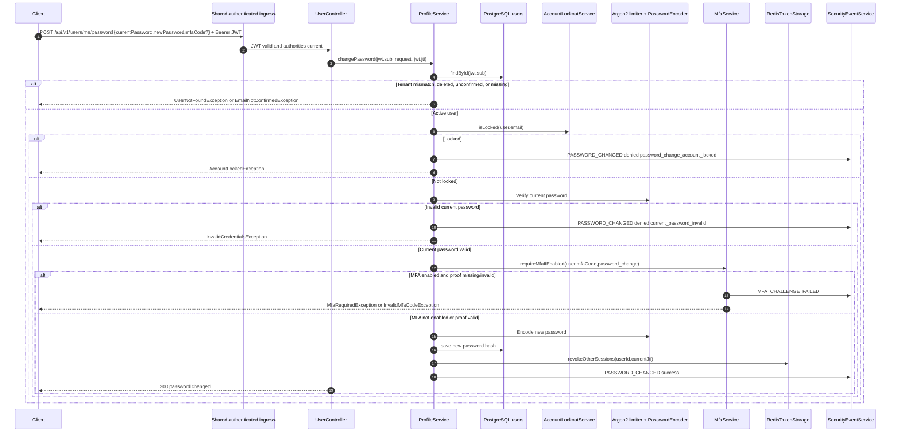
```mermaid
sequenceDiagram
    autonumber
    participant C as Client
    participant I as Shared authenticated ingress
    participant UC as UserController
    participant PS as ProfileService
    participant DB as PostgreSQL users
    participant LS as AccountLockoutService
    participant ARG as Argon2 limiter + PasswordEncoder
    participant MFA as MfaService
    participant TS as RedisTokenStorage
    participant AUD as SecurityEventService

    C->>I: POST /api/v1/users/me/password {currentPassword,newPassword,mfaCode?} + Bearer JWT
    I->>UC: JWT valid and authorities current
    UC->>PS: changePassword(jwt.sub, request, jwt.jti)
    PS->>DB: findById(jwt.sub)
    alt Tenant mismatch, deleted, unconfirmed, or missing
        PS-->>C: UserNotFoundException or EmailNotConfirmedException
    else Active user
        PS->>LS: isLocked(user.email)
        alt Locked
            PS->>AUD: PASSWORD_CHANGED denied password_change_account_locked
            PS-->>C: AccountLockedException
        else Not locked
            PS->>ARG: Verify current password
            alt Invalid current password
                PS->>AUD: PASSWORD_CHANGED denied current_password_invalid
                PS-->>C: InvalidCredentialsException
            else Current password valid
                PS->>MFA: requireMfaIfEnabled(user,mfaCode,password_change)
                alt MFA enabled and proof missing/invalid
                    MFA->>AUD: MFA_CHALLENGE_FAILED
                    MFA-->>C: MfaRequiredException or InvalidMfaCodeException
                else MFA not enabled or proof valid
                    PS->>ARG: Encode new password
                    PS->>DB: save new password hash
                    PS->>TS: revokeOtherSessions(userId,currentJti)
                    PS->>AUD: PASSWORD_CHANGED success
                    UC-->>C: 200 password changed
                end
            end
        end
    end
```

## 13A. MFA Management

`GET /api/v1/users/me/mfa`, `POST /api/v1/users/me/mfa/totp/enroll`, `POST /api/v1/users/me/mfa/totp/confirm`, `DELETE /api/v1/users/me/mfa/totp`, `POST /api/v1/users/me/mfa/backup-codes`

Infrastructure role: MFA management is bearer-authenticated and scoped to the JWT subject. Enrollment requires current-password step-up and replaces stale pending credentials. TOTP secrets are encrypted with versioned AES-GCM envelopes using PBKDF2-derived keys and a key id before PostgreSQL persistence. Confirmation verifies a live TOTP code, generates one-time backup codes, stores only keyed hashes, revokes refresh sessions, and audits the change. Disabling MFA and regenerating backup codes require both current-password and MFA proof.

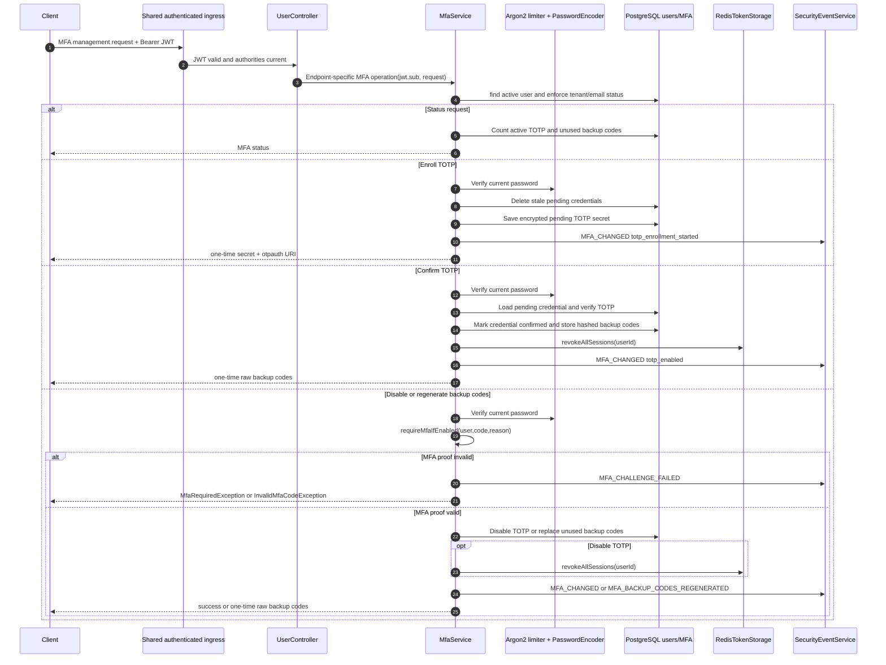
```mermaid
sequenceDiagram
    autonumber
    participant C as Client
    participant I as Shared authenticated ingress
    participant UC as UserController
    participant MFA as MfaService
    participant ARG as Argon2 limiter + PasswordEncoder
    participant DB as PostgreSQL users/MFA
    participant TS as RedisTokenStorage
    participant AUD as SecurityEventService

    C->>I: MFA management request + Bearer JWT
    I->>UC: JWT valid and authorities current
    UC->>MFA: Endpoint-specific MFA operation(jwt.sub, request)
    MFA->>DB: find active user and enforce tenant/email status
    alt Status request
        MFA->>DB: Count active TOTP and unused backup codes
        MFA-->>C: MFA status
    else Enroll TOTP
        MFA->>ARG: Verify current password
        MFA->>DB: Delete stale pending credentials
        MFA->>DB: Save encrypted pending TOTP secret
        MFA->>AUD: MFA_CHANGED totp_enrollment_started
        MFA-->>C: one-time secret + otpauth URI
    else Confirm TOTP
        MFA->>ARG: Verify current password
        MFA->>DB: Load pending credential and verify TOTP
        MFA->>DB: Mark credential confirmed and store hashed backup codes
        MFA->>TS: revokeAllSessions(userId)
        MFA->>AUD: MFA_CHANGED totp_enabled
        MFA-->>C: one-time raw backup codes
    else Disable or regenerate backup codes
        MFA->>ARG: Verify current password
        MFA->>MFA: requireMfaIfEnabled(user,code,reason)
        alt MFA proof invalid
            MFA->>AUD: MFA_CHALLENGE_FAILED
            MFA-->>C: MfaRequiredException or InvalidMfaCodeException
        else MFA proof valid
            MFA->>DB: Disable TOTP or replace unused backup codes
            opt Disable TOTP
                MFA->>TS: revokeAllSessions(userId)
            end
            MFA->>AUD: MFA_CHANGED or MFA_BACKUP_CODES_REGENERATED
            MFA-->>C: success or one-time raw backup codes
        end
    end
```

## 14. List My Sessions

`GET /api/v1/users/me/sessions`

Infrastructure role: the caller must present a first-party access token with an active Redis session (`jwt.jti`); active refresh sessions are listed from the user's Redis token hash by JTI; user activity and tenant checks happen before exposing session identifiers.

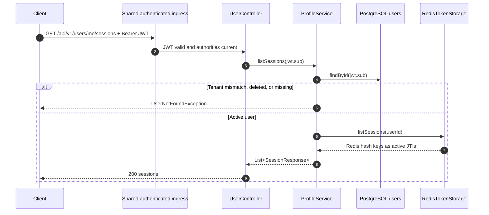
```mermaid
sequenceDiagram
    autonumber
    participant C as Client
    participant I as Shared authenticated ingress
    participant UC as UserController
    participant PS as ProfileService
    participant DB as PostgreSQL users
    participant TS as RedisTokenStorage

    C->>I: GET /api/v1/users/me/sessions + Bearer JWT
    I->>UC: JWT valid and authorities current
    UC->>PS: listSessions(jwt.sub)
    PS->>DB: findById(jwt.sub)
    alt Tenant mismatch, deleted, or missing
        PS-->>C: UserNotFoundException
    else Active user
        PS->>TS: listSessions(userId)
        TS-->>PS: Redis hash keys as active JTIs
        PS-->>UC: List<SessionResponse>
        UC-->>C: 200 sessions
    end
```

## 15. Revoke One Session

`DELETE /api/v1/users/me/sessions/{jti}`

Infrastructure role: revocation is scoped to the authenticated user's Redis refresh-token hash, which prevents cross-user session deletion; lockout blocks session management; MFA proof is required when enabled for the account; success is audited as logout/session revocation.

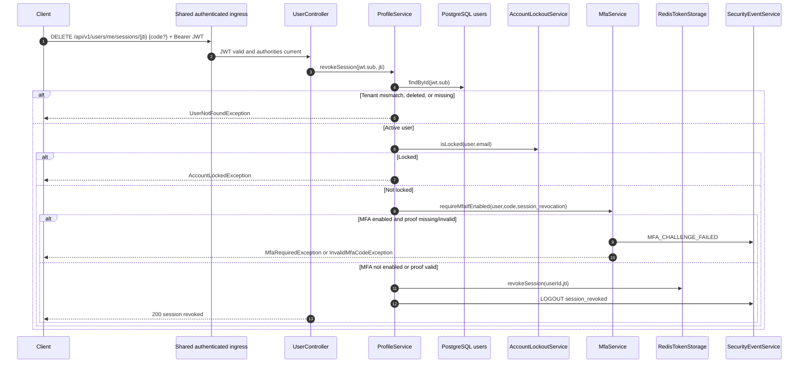
```mermaid
sequenceDiagram
    autonumber
    participant C as Client
    participant I as Shared authenticated ingress
    participant UC as UserController
    participant PS as ProfileService
    participant DB as PostgreSQL users
    participant LS as AccountLockoutService
    participant MFA as MfaService
    participant TS as RedisTokenStorage
    participant AUD as SecurityEventService

    C->>I: DELETE /api/v1/users/me/sessions/{jti} {code?} + Bearer JWT
    I->>UC: JWT valid and authorities current
    UC->>PS: revokeSession(jwt.sub, jti)
    PS->>DB: findById(jwt.sub)
    alt Tenant mismatch, deleted, or missing
        PS-->>C: UserNotFoundException
    else Active user
        PS->>LS: isLocked(user.email)
        alt Locked
            PS-->>C: AccountLockedException
        else Not locked
            PS->>MFA: requireMfaIfEnabled(user,code,session_revocation)
            alt MFA enabled and proof missing/invalid
                MFA->>AUD: MFA_CHALLENGE_FAILED
                MFA-->>C: MfaRequiredException or InvalidMfaCodeException
            else MFA not enabled or proof valid
                PS->>TS: revokeSession(userId,jti)
                PS->>AUD: LOGOUT session_revoked
                UC-->>C: 200 session revoked
            end
        end
    end
```

## 16. Delete My Account

`DELETE /api/v1/users/me`

Infrastructure role: deletion requires bearer auth, password step-up, and MFA proof when MFA is enabled; user PII is anonymized immediately in PostgreSQL; deletion and anonymization audit rows are synchronously flushed in the same transaction so audit failure rolls the mutation back; authority cache eviction, Redis session revocation, and outbox cleanup occur after commit; retention jobs later purge deleted-account tombstones according to configuration.

```mermaid
sequenceDiagram
    autonumber
    participant C as Client
    participant I as Shared authenticated ingress
    participant UC as UserController
    participant ALS as AccountLifecycleService
    participant DB as PostgreSQL users
    participant ARG as Argon2 limiter + PasswordEncoder
    participant MFA as MfaService
    participant ACa as Authority Caffeine
    participant TS as RedisTokenStorage
    participant AUD as SecurityEventService
    participant MET as MeterRegistry

    C->>I: DELETE /api/v1/users/me {currentPassword,mfaCode?} + Bearer JWT
    I->>UC: JWT valid and authorities current
    UC->>ALS: requestDeletion(jwt.sub, stepUpRequest)
    ALS->>DB: findById(jwt.sub)
    alt User inactive, tenant mismatch, or unconfirmed
        ALS-->>C: Access denied as not found/unconfirmed
    else Active user
        ALS->>ARG: Verify current password
        alt Missing/invalid password
            ALS->>AUD: ACCOUNT_DELETION_REQUESTED denied
            ALS-->>C: InvalidCredentialsException
        else Valid password
            ALS->>MFA: requireMfaIfEnabled(user,mfaCode,account_deletion)
            alt MFA enabled and proof missing/invalid
                MFA-->>C: MfaRequiredException or InvalidMfaCodeException
            else No MFA or valid MFA proof
                ALS->>ARG: Encode random replacement password
                ALS->>DB: mark deletion requested, deleted, anonymized; replace direct PII
                ALS-->>UC: AccountDeletionResponse
                UC-->>C: 200 deleted
                ALS->>ACa: afterCommit evict user authorities
                ALS->>TS: afterCommit revokeAllSessions(userId)
                alt Redis revocation fails
                    ALS->>MET: security.infrastructure.failure component=token_storage
                end
                ALS->>AUD: ACCOUNT_DELETION_REQUESTED success
                ALS->>AUD: ACCOUNT_ANONYMIZED success
            end
        end
    end
```

## 17. Passkey Registration And Management

`GET /api/v1/users/me/passkeys`, `POST /api/v1/users/me/passkeys/options`, `POST /api/v1/users/me/passkeys`, `DELETE /api/v1/users/me/passkeys/{credentialId}`

Infrastructure role: registration is authenticated and bound to the current user tenant. AuthKit delegates WebAuthn ceremony validation to Yubico `webauthn-server-core`, requires authenticator user verification, stores only public credential material in PostgreSQL, persists short-lived challenge state in `passkey_challenges` for horizontal safety, and requires current-password step-up plus MFA proof for registration/disablement when MFA is already enabled.

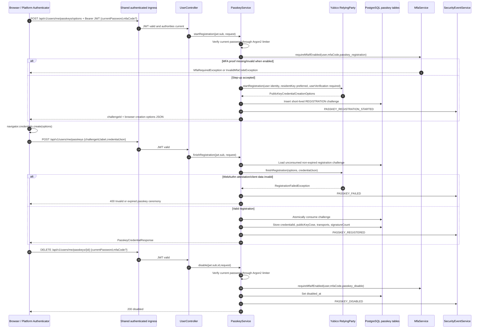
```mermaid
sequenceDiagram
    autonumber
    participant C as Browser / Platform Authenticator
    participant I as Shared authenticated ingress
    participant UC as UserController
    participant PS as PasskeyService
    participant RP as Yubico RelyingParty
    participant DB as PostgreSQL passkey tables
    participant MFA as MfaService
    participant AUD as SecurityEventService

    C->>I: POST /api/v1/users/me/passkeys/options + Bearer JWT {currentPassword,mfaCode?}
    I->>UC: JWT valid and authorities current
    UC->>PS: startRegistration(jwt.sub, request)
    PS->>PS: Verify current password through Argon2 limiter
    PS->>MFA: requireMfaIfEnabled(user,mfaCode,passkey_registration)
    alt MFA proof missing/invalid when enabled
        MFA-->>C: MfaRequiredException or InvalidMfaCodeException
    else Step-up accepted
        PS->>RP: startRegistration(user identity, residentKey preferred, userVerification required)
        RP-->>PS: PublicKeyCredentialCreationOptions
        PS->>DB: Insert short-lived REGISTRATION challenge
        PS->>AUD: PASSKEY_REGISTRATION_STARTED
        PS-->>C: challengeId + browser creation options JSON
    end

    C->>C: navigator.credentials.create(options)
    C->>I: POST /api/v1/users/me/passkeys {challengeId,label,credentialJson}
    I->>UC: JWT valid
    UC->>PS: finishRegistration(jwt.sub, request)
    PS->>DB: Load unconsumed non-expired registration challenge
    PS->>RP: finishRegistration(options, credentialJson)
    alt WebAuthn attestation/client data invalid
        RP-->>PS: RegistrationFailedException
        PS->>AUD: PASSKEY_FAILED
        PS-->>C: 400 Invalid or expired passkey ceremony
    else Valid registration
        PS->>DB: Atomically consume challenge
        PS->>DB: Store credentialId, publicKeyCose, transports, signatureCount
        PS->>AUD: PASSKEY_REGISTERED
        PS-->>C: PasskeyCredentialResponse
    end

    C->>I: DELETE /api/v1/users/me/passkeys/{id} {currentPassword,mfaCode?}
    I->>UC: JWT valid
    UC->>PS: disable(jwt.sub,id,request)
    PS->>PS: Verify current password through Argon2 limiter
    PS->>MFA: requireMfaIfEnabled(user,mfaCode,passkey_disable)
    PS->>DB: Set disabled_at
    PS->>AUD: PASSKEY_DISABLED
    PS-->>C: 200 disabled
```

## 18. Passkey Login

`POST /api/v1/auth/passkeys/options`, `POST /api/v1/auth/passkeys/verify`

Infrastructure role: passkey login is public until assertion verification succeeds. Optional email narrows the allow-list without enumeration guarantees; discoverable credentials are supported when email is omitted. Successful assertions update the signature counter, issue normal HttpOnly refresh and CSRF cookies, and produce an RS256 access JWT with `amr=["webauthn"]` whose `jti` is bound to the new Redis refresh session.

```mermaid
sequenceDiagram
    autonumber
    participant C as Browser / Platform Authenticator
    participant I as Shared ingress filters
    participant AC as AuthController
    participant PS as PasskeyService
    participant RP as Yubico RelyingParty
    participant DB as PostgreSQL passkey/user/challenge tables
    participant AS as AuthService
    participant TS as RedisTokenStorage
    participant JWT as JwtEncoder
    participant AUD as SecurityEventService

    C->>I: POST /api/v1/auth/passkeys/options {email?}
    I->>AC: Public endpoint after origin/rate/body checks
    AC->>PS: startAssertion(request)
    PS->>DB: Optional user lookup and credential allow-list
    PS->>RP: startAssertion(userVerification required)
    PS->>DB: Insert ASSERTION challenge
    PS->>AUD: PASSKEY_AUTHENTICATION_STARTED
    PS-->>C: challengeId + browser request options JSON
    C->>C: navigator.credentials.get(options)
    C->>I: POST /api/v1/auth/passkeys/verify {challengeId,credentialJson}
    AC->>PS: finishAssertion(request)
    PS->>DB: Load unconsumed non-expired assertion challenge
    PS->>RP: finishAssertion(challenge, assertionJson)
    alt Signature/origin/challenge invalid
        RP-->>PS: AssertionFailedException
        PS->>AUD: PASSKEY_FAILED
        PS-->>C: 400 Invalid passkey ceremony
    else Assertion valid
        PS->>DB: Atomically consume challenge
        PS->>DB: Update signatureCount and lastUsedAt
        PS->>AUD: PASSKEY_AUTHENTICATED
        PS->>AS: issueLoginForVerifiedUser(user, ["webauthn"])
        AS->>TS: Store refresh token hash/family in Redis
        AS->>JWT: Sign RS256 JWT with tenant_id and amr=["webauthn"]
        AS->>AUD: LOGIN_SUCCESS
        AC-->>C: 200 accessToken + HttpOnly refresh cookie + CSRF cookie
    end
```

## 19. OAuth2/OIDC Provider Flow

`POST /api/v1/oauth2/authorize`, `POST /oauth2/token`, `POST /oauth2/revoke`, `POST /oauth2/introspect`, `GET /oauth2/userinfo`, `GET /.well-known/openid-configuration`

Infrastructure role: AuthKit acts as an API-oriented OAuth2/OIDC provider for authorization-code + PKCE. The authorization endpoint requires an already-authenticated **first-party** user token (`aud` = `AUTH_JWT_AUDIENCE`, active Redis session) plus explicit user consent unless an active consent already covers the requested client scopes; client applications are managed through the admin policy plane. OAuth consents are durable PostgreSQL rows included in account export. Authorization codes are high-entropy one-time values stored as SHA-256 hashes in PostgreSQL and consumed atomically before RS256 access/ID token issuance with `aud` set to the OAuth `client_id` (not the first-party API audience). `/oauth2/token`, `/oauth2/revoke`, and `/oauth2/introspect` are public routes with client/endpoint throttles. `/oauth2/userinfo` is a public route that decodes the OAuth access token inside `OAuthProviderService` (it does not use first-party session binding). Revoked OAuth token `jti` values are tracked in Redis when available and in local Caffeine as fallback. OAuth access tokens must not be sent to `/api/v1/users/**` or `/api/v1/admin/**` (wrong `aud` and no refresh session).

```mermaid
sequenceDiagram
    autonumber
    participant App as Client Application
    participant I as Shared ingress filters
    participant OC as OAuthController
    participant OPS as OAuthProviderService
    participant CR as OAuthClientRepository
    participant CONS as PostgreSQL oauth_consents
    participant DB as PostgreSQL authorization_codes
    participant UDB as PostgreSQL users
    participant JWT as JwtEncoder/JWKS
    participant AUD as SecurityEventService

    App->>I: GET /.well-known/openid-configuration
    I->>OC: Public discovery
    OC-->>App: issuer, auth/token/revoke/introspect/userinfo endpoints, jwks_uri, PKCE S256

    App->>I: POST /api/v1/oauth2/authorize + Bearer JWT {clientId,redirectUri,scope,codeChallenge,S256,nonce,state,consentAccepted}
    I->>OC: First-party JWT valid with active Redis session
    OC->>OPS: authorize(jwt, request)
    OPS->>CR: Load enabled client
    OPS->>OPS: Exact redirect URI match and scope subset check
    OPS->>UDB: Load active confirmed user
    OPS->>CONS: Load active consent for user+client
    alt Consent missing or scopes expanded
        OPS->>OPS: Require consentAccepted=true
        OPS->>CONS: Insert/update durable OAuth consent
        OPS->>AUD: OAUTH_CONSENT_GRANTED
    else Existing consent covers requested scopes
        OPS->>CONS: Reuse active consent
    end
    OPS->>DB: Store hashed authorization code with PKCE challenge, scopes, amr, nonce, expiry
    OPS->>AUD: OAUTH_AUTHORIZATION_CODE_ISSUED
    OPS-->>App: redirectUri?code=...&state=...

    App->>I: POST /oauth2/token form grant_type=authorization_code, code, redirect_uri, client_id, code_verifier
    I->>OC: Public token endpoint after origin/rate/body checks
    OC->>OPS: token(...)
    OPS->>CR: Validate public/confidential client
    OPS->>DB: Load unconsumed non-expired code hash
    OPS->>OPS: Verify PKCE S256 code_verifier
    OPS->>DB: Atomically mark code consumed
    OPS->>UDB: Load active confirmed user
    OPS->>JWT: Sign access token for client audience
    opt openid scope requested
        OPS->>JWT: Sign ID token with nonce,email,email_verified,tenant_id,amr
    end
    OPS->>AUD: OAUTH_TOKEN_ISSUED
    OPS-->>App: access_token, id_token?, token_type=Bearer, expires_in, scope

    App->>I: POST /oauth2/introspect form token, client_id, client_secret
    OPS->>OPS: Validate confidential client and decode token
    OPS-->>App: active, sub, aud, scope, exp, iat, iss, client_id

    App->>I: POST /oauth2/revoke form token, client_id, client_secret?
    OPS->>OPS: Validate client, decode token, store revoked jti until expiry
    OPS-->>App: 200 empty success

    App->>I: GET /oauth2/userinfo + Bearer OAuth access token
    I->>OC: Public route (no UserAuthoritiesFilter session binding)
    OC->>OPS: userInfo(bearerToken)
    OPS->>OPS: Decode OAuth JWT (client audience), require openid scope, filter claims by scopes
    OPS-->>App: sub, email?, email_verified?, name?
```

## 20. Admin And Policy Plane

`/api/v1/admin/**`

Infrastructure role: admin routes require a live first-party bearer JWT with `ROLE_ADMIN` and an active Redis refresh session; `UserAuthoritiesFilter` refreshes the role snapshot from Caffeine/PostgreSQL before controller execution. Write operations require current-password step-up and MFA proof, with passkeys preferred for phishing resistance and TOTP accepted as fallback. Admin writes are tenant-throttled, preserve a last-admin guard, hash OAuth client secrets at rest, support confidential-client secret rotation with one-time return, and emit high-severity durable audit events.

```mermaid
sequenceDiagram
    autonumber
    participant A as Admin Client
    participant I as Shared authenticated ingress
    participant AF as UserAuthoritiesFilter
    participant AC as AdminController
    participant AS as AdminService
    participant MFA as MfaService
    participant UDB as PostgreSQL users
    participant CDB as PostgreSQL oauth_clients
    participant AUD as SecurityEventService

    A->>I: GET /api/v1/admin/users or /tenants or /oauth-clients + Bearer JWT
    I->>AF: First-party JWT, active Redis session, refreshed authorities
    AF->>AC: ROLE_ADMIN confirmed
    AC->>AS: list operation
    AS->>UDB: Read users/tenants or clients
    AS-->>A: Privacy-bounded admin response

    A->>I: PATCH /api/v1/admin/users/{id}/role {role,currentPassword,mfaCode?}
    I->>AF: First-party JWT, active Redis session, refreshed authorities
    AF->>AC: ROLE_ADMIN confirmed
    AC->>AS: updateRole(jwt,id,request)
    AS->>UDB: Load admin and target user
    AS->>MFA: Require password step-up and MFA/passkey proof
    AS->>AS: Enforce last-active-admin guard
    AS->>UDB: Persist role
    AS->>AUD: ADMIN_ACTION target=changed user
    AS-->>A: Updated AdminUserResponse

    A->>I: POST/PATCH/DELETE /api/v1/admin/oauth-clients
    I->>AF: First-party JWT, active Redis session, refreshed authorities
    AF->>AC: ROLE_ADMIN confirmed
    AC->>AS: client management command
    AS->>MFA: Require password step-up and MFA/passkey proof
    AS->>AS: Validate HTTPS redirect URIs, scopes, PKCE policy
    alt Create confidential client
        AS->>CDB: Store slow hash of client secret only
        AS-->>A: Raw client secret returned once
    else Rotate confidential client secret
        AS->>CDB: Store new slow secret hash
        AS-->>A: New raw client secret returned once
    else Update or disable client
        AS->>CDB: Persist metadata or disabled_at
        AS-->>A: Updated client metadata, no secret
    end
    AS->>AUD: OAUTH_CLIENT_CREATED/OAUTH_CLIENT_UPDATED
```

## 21. Get JWKS

`GET /.well-known/jwks.json`

Infrastructure role: this public endpoint publishes the active RSA public key plus configured retiring public keys, excluding emergency-revoked key IDs. Downstream services use the `kid` header to select a key during rotation and must reject revoked or unknown keys.

```mermaid
sequenceDiagram
    autonumber
    participant C as Downstream service or client
    participant I as Shared ingress filters
    participant JC as JwksController
    participant CFG as JwtKeyService/AuthProperties

    C->>I: GET /.well-known/jwks.json
    I->>JC: Public endpoint after origin/rate checks
    JC->>CFG: Build active + retiring public JWK set
    JC-->>C: JWK Set with non-revoked RSA public keys, kid, use=sig, alg=RS256
```

## 22. Background Email Delivery Flow

This flow is not a direct controller endpoint, but it is part of registration, password recovery, and password reset completion.

Infrastructure role: request handlers only enqueue messages in PostgreSQL; the `EmailOutboxProcessor` is coordinated across replicas by ShedLock using PostgreSQL database time and a maximum ten-minute lock. Conditional state updates make duplicate/stale worker results idempotent: stale failures cannot overwrite `SENT`. The stable outbox UUID remains the Resend idempotency key. Retryable failures use bounded backoff and move to terminal `DEAD` after the configured maximum (default 10), keeping automatic retry behavior within Resend's 24-hour idempotency window. In `queue` mode, publish moves the row to `QUEUED` and provider acceptance moves it to `SENT`; direct mode uses the same durable states through a bounded worker pool.

```mermaid
sequenceDiagram
    autonumber
    participant S as Registration/Recovery service
    participant OB as EmailOutboxService
    participant DB as PostgreSQL email_outbox
    participant OP as EmailOutboxProcessor scheduler
    participant DS as EmailDispatchStrategy
    participant MQ as RabbitMQ exchange/queue
    participant EL as RabbitMqEmailListener
    participant EP as EmailProvider
    participant MET as MeterRegistry

    S->>OB: enqueue(EmailPayload)
    OB->>DB: Insert PENDING in same app transaction
    OP->>DB: claimDueMessages(batchSize, lockTtl)
    DB-->>OP: Mark claimable rows PROCESSING
    loop Each claimed message
        OP->>DS: dispatch(message)
        alt queue mode
            DS->>MQ: publish EmailPayload
            alt Rabbit publish succeeds
                DS->>DB: markQueued(messageId, delivery ack timeout)
                MQ->>EL: Deliver message
                EL->>EP: Send email with HTTP timeouts and idempotency key
                alt Provider accepted
                    EL->>DB: markSent(messageId, providerMessageId)
                else Provider failed
                    EL->>MET: security.infrastructure.failure component=email_provider
                    EL->>DB: markFailed(messageId,error)
                end
            else Rabbit publish fails
                OP->>MET: security.infrastructure.failure component=email_outbox
                OP->>DB: markFailed(messageId,error)
            end
        else direct mode
            DS-->>OP: Provider work submitted to bounded executor
            DS->>DB: Worker markQueued(messageId, delivery ack timeout)
            DS->>EP: Worker sends email with provider idempotency when available
            alt Provider accepted
                DS->>DB: markSent(messageId, providerMessageId)
            else Provider failed
                DS->>MET: security.infrastructure.failure component=email_provider
                DS->>DB: markFailed(messageId,error)
            end
        end
    end
```

## 23. Background Retention Flow

This flow is not a direct controller endpoint, but it supports production privacy and audit retention requirements.

Infrastructure role: `DataRetentionService` runs from the configured cron and is coordinated across replicas by PostgreSQL-backed ShedLock (minimum one-minute, maximum two-hour lock). Repeated or retried execution is harmless: it selects bounded ID batches and uses conditional/idempotent deletes for expired security events, deleted-account tombstones, passkey challenges, and OAuth authorization codes.

```mermaid
sequenceDiagram
    autonumber
    participant SCH as Scheduler
    participant DRS as DataRetentionService
    participant SE as security_events
    participant DB as users
    participant PK as passkey_challenges
    participant OA as oauth_authorization_codes

    SCH->>DRS: purgeExpiredSecurityEvents() on cron
    loop Bounded security-event batches
        DRS->>SE: findExpiredIds(cutoff, PageRequest(batchSize))
        alt No expired ids
            DRS-->>SCH: Done
        else Expired ids found
            DRS->>SE: purgeByIdIn(ids) in REQUIRES_NEW transaction
        end
    end
    loop Bounded deleted-user batches
        DRS->>DB: findDeletedIdsBefore(cutoff, PageRequest(batchSize))
        alt No expired tombstones
            DRS-->>SCH: Done
        else Expired tombstones found
            DRS->>DB: purgeDeletedByIdIn(ids) in REQUIRES_NEW transaction
        end
    end
    DRS->>PK: deleteExpired(now)
    DRS->>OA: deleteExpired(now)
```

## Production Readiness Note

AuthKit does not create servlet HTTP sessions, but first-party API access is **not** purely stateless at the application boundary: access tokens are self-contained RS256 JWTs (downstream resource servers can verify them offline using JWKS), while **AuthKit's own `/api/v1/**` and `/api/v1/admin/**` routes** additionally require JWT `jti` to match an active refresh session in Redis until logout, password reset, session revocation, or family compromise revokes that session. OAuth-issued access tokens use `aud` = `client_id`, are not stored in the refresh-session hash, and are intended for `/oauth2/userinfo`, introspection, and external resource servers—not first-party user/admin APIs.

The other deliberate security state includes: refresh-token families, MFA login challenges, recovery tokens, distributed rate-limit and abuse-throttle buckets, lockout buckets, authority snapshots, encrypted TOTP credentials, hashed backup codes, OAuth revoked-`jti` tracking, email outbox rows, and durable audit/consent records.

Production strengths visible in the current implementation:

- Reverse-proxy trust boundary is enforced in Kubernetes and in application filters.
- Volumetric protection happens before JSON parsing and password hashing, with route-specific abuse throttles on high-risk auth and account-management endpoints.
- Password hashing work is concurrency-bounded to reduce hashing DoS risk.
- Password policy rejects weak, common, identity-derived, current, and recent-history passwords.
- Refresh tokens are HttpOnly cookies, server-side hashed in Redis, rotated atomically with O(1) family pointers, and family reuse is audited as critical. Issued first-party access JWTs embed the refresh-session `jti`; `UserAuthoritiesFilter` rejects requests when that session is no longer active.
- MFA login challenges are one-time Redis entries; TOTP secrets are encrypted at rest with versioned AES-GCM envelopes and PBKDF2-derived keys; backup codes are stored as keyed hashes and consumed atomically.
- Passkey/WebAuthn ceremonies are verified by Yubico `webauthn-server-core`; authenticator user verification is required, only public credential material is persisted, registration/disablement require password step-up plus MFA when enabled, short-lived challenges are one-time database rows, passkey login emits `amr=["webauthn"]`, and passkeys are the preferred admin MFA method.
- OAuth2/OIDC provider support uses authorization-code + PKCE with durable per-client consent, one-time hashed authorization codes, slow-hashed confidential client secrets with rotation, exact redirect URI validation, revocation, introspection, userinfo, JWKS-backed RS256 token signing, and admin-managed client registration.
- JWT signing supports active and retiring public keys in JWKS plus emergency key-id revocation; the resource-server decoder also rejects revoked token `jti` values and emergency revoked `kid` values before controller logic runs.
- The admin policy plane is server-enforced with `ROLE_ADMIN`, live authority refresh, password step-up plus MFA/passkey proof for sensitive writes, one-time OAuth client secret return, and high-severity durable audit events.
- Authenticated first-party routes rehydrate live authorities and enforce active Redis session binding instead of trusting stale JWT roles or revoked refresh sessions indefinitely.
- Email delivery is outbox-backed and does not hold user transactions open while calling RabbitMQ or the configured provider; `SENT` means provider acceptance, not merely queue publish.
- Security and consent events are durable, privacy-safe, metric-backed, and alertable.
- Account export/deletion require current-password step-up and MFA proof when MFA is enabled; password change, logout-all, session revocation, MFA disablement, and backup-code regeneration also require MFA proof when MFA is enabled.
- MFA failures are split into generic challenge, login, and step-up metrics so account-takeover attempts can be distinguished from sensitive-operation abuse without exposing user identifiers as metric labels.

Operational caveats to keep in mind before production:

- Redis is a hard dependency for refresh tokens, recovery tokens, and MFA login challenges and must require authentication; rate limiting and lockout have local fallback. High-risk endpoint abuse throttles degrade to stricter local limits and emit critical metrics when Redis is unavailable.
- The Kubernetes service is intended to sit behind an ingress controller; real client IP handling depends on trusted ingress/proxy headers and the configured `network.proxy-depth`.
- CORS is enforced in-app from explicit configured origins; production startup rejects wildcard-with-credentials and non-HTTPS origins.
- No frontend is included in this repository; browser storage, XSS controls, and redirect UX must be validated in the consuming application.
- `/actuator/prometheus` requires a trusted source network plus the internal worker token. Production scraping should inject `X-Worker-Token` from a secret through Prometheus, a scrape proxy, or ingress-level header injection, rotate through the previous-token window, and still constrain source networks with NetworkPolicy.
- NetworkPolicy cannot restrict Resend egress by FQDN; production clusters should use an egress gateway, DNS policy, or cloud firewall where available.
- Downstream services must validate JWT issuer, audience (`AUTH_JWT_AUDIENCE` for first-party tokens, `client_id` for OAuth tokens), expiration, signature algorithm, `kid`, tenant, scopes/authorities, and JWKS rotation behavior. They should refresh JWKS on unknown `kid` and should not call AuthKit per request unless they need a live revocation/authorization decision beyond token TTL. Only first-party tokens participate in AuthKit refresh-session binding; OAuth tokens rely on `/oauth2/introspect` or local revocation state when needed.
- OAuth2/OIDC support currently implements the provider role; social-login relying-party federation is intentionally not part of this service role and should be added as a separate integration if needed.
- Admin tenant management reflects AuthKit's current one-tenant-per-user model. Broader organization/team tenancy should introduce first-class tenant membership tables before using AuthKit as a multi-user SaaS tenant authority.
