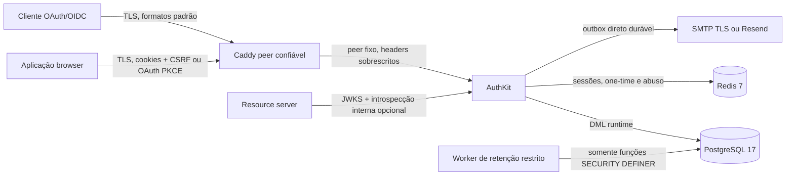
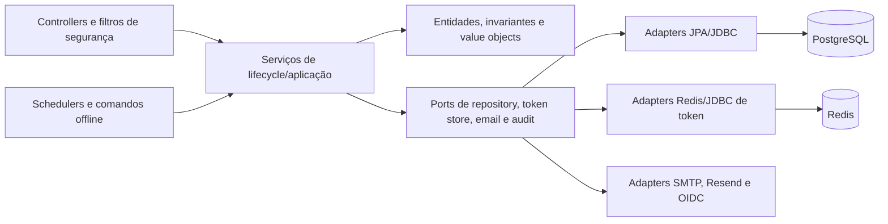
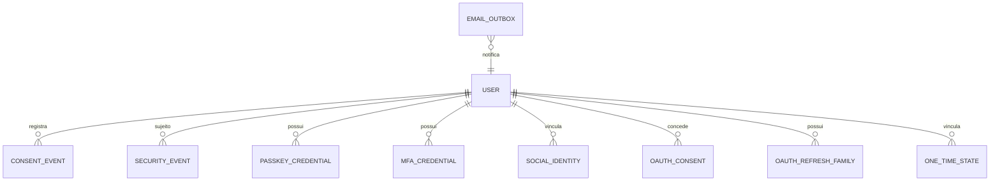
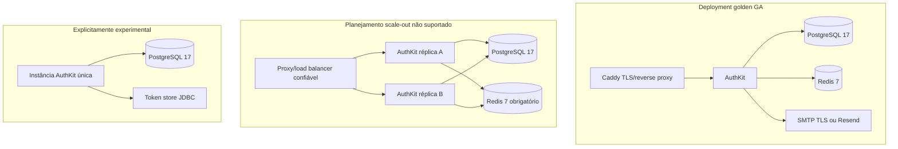
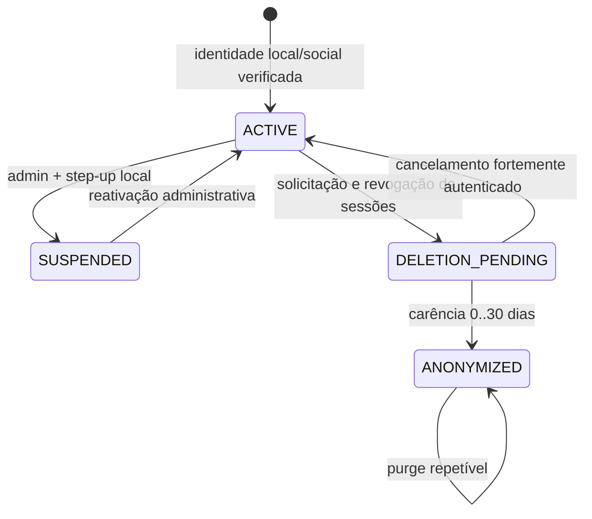
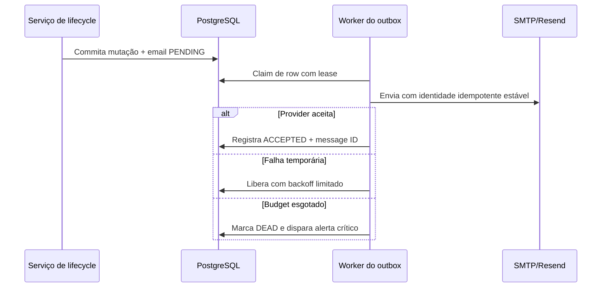
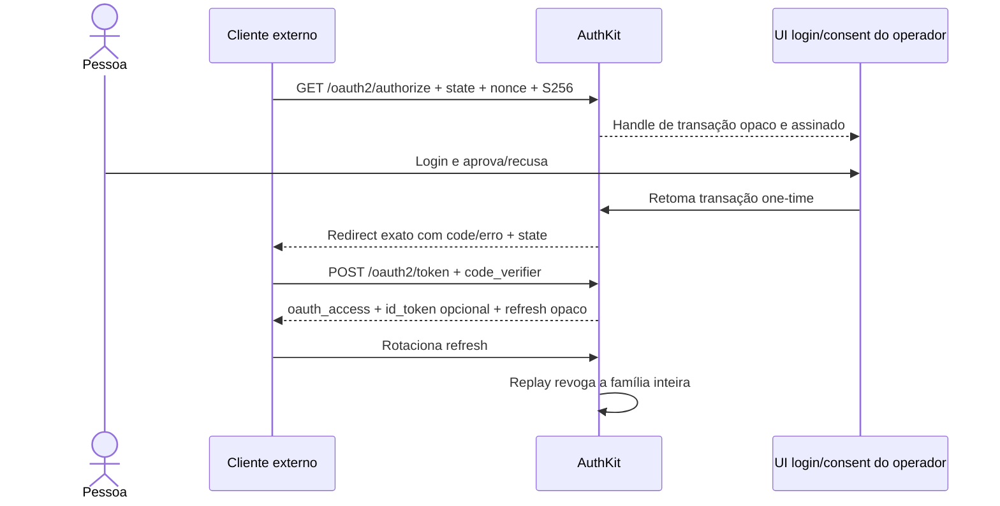
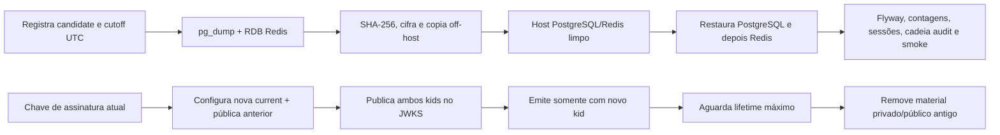

# Design de sistema do AuthKit v0.1

[English](SYSTEM_DESIGN.md) | [Português (Brasil)](SYSTEM_DESIGN-ptBR.md)

O inglês é autoritativo quando houver divergência de tradução.

## Fronteiras de confiança e dados



O browser não recebe tokens do provider após federação. Refresh first-party fica em cookie HttpOnly same-site com CSRF double-submit; access token é curto e somente em memória. Clientes OAuth cross-site usam Authorization Code, state, nonce, redirect exato e PKCE S256. Refresh OAuth é opaco, rotativo e ligado a família travada. `tenant_id` particiona os registros de uma pessoa e não carrega autoridade organizacional.

## Direção das dependências internas



Código de transporte não chama adapters de persistência diretamente. Serviços controlam transações; audit crítico e estado SQL usam a mesma transação, enquanto revogação/cache não transacional é registrado somente após commit. O domínio não depende de Spring MVC, Redis, SMTP nem formatos wire de providers.

## Propriedade dos dados



PostgreSQL é autoritativo para usuários, lifecycle, consentimentos, famílias OAuth, counters WebAuthn, email durável e audit. Redis possui sessões first-party expirantes, estado distribuído de abuso/lockout e alguns claims one-time; chaves carregam vínculo user/tenant e TTL. Tokens de provider são validados e descartados, não persistidos.

## Variantes de deployment



A topologia Compose golden é a referência de fresh install. Layouts browser same-site e OAuth cross-site diferem em cookie/CORS, não na confiança de forwarded headers. Token store JDBC é restrito a uma instância e nunca substitui Redis quando o gate exige Redis real.

## Lifecycle de identidade



Anonimização é irreversível. Retenção de segurança/consentimento é limitada e append-only para o runtime; deleção só ocorre pelo papel separado através de procedimentos auditados. O último administrador ativo é protegido no serviço e por trigger serializado PostgreSQL.

## Fronteiras one-time e transacionais

Confirmação e mudança de e-mail travam a linha do usuário. Recovery usa Lua Redis atômico ou JDBC travado com compensação finalize/release. Transações/codes OAuth, state social, nonce, PKCE, refresh e counters de passkey são consumidos condicionalmente ou atualizados monotonicamente. Auditoria crítica é síncrona na transação; sua falha aborta a mutação.

Criação do e-mail e estado de negócio commitam com o outbox. Dispatch ocorre fora: SMTP faz uma tentativa por claim e o outbox controla retries; Resend adiciona retry limitado e idempotente. Aceite do provider e entrega na inbox são fatos distintos.



## Classes de token e revogação

| Classe | `token_use` | Audience | Revogação |
| --- | --- | --- | --- |
| Access first-party | `first_party_access` | API configurada | sessão/JTI vivo e `session_version` PostgreSQL sem cache; consumers offline limitados a ≤300 s |
| Access OAuth | `oauth_access` | cliente OAuth | cliente/família/JTI e introspecção autenticada |
| ID token OIDC | `id_token` | cliente OAuth | declaração de autenticação; nunca bearer de API |

Ausência ou divergência de classe, issuer, audience, assinatura, expiração, `kid` ou claims é rejeitada. JWKS publica apenas chaves públicas atuais/retiring. O contrato está no [OpenAPI](../openapi.yaml) e deveres do operador em [Operações](../OPERATIONS-ptBR.md).

## Casos de uso principais

### Conta e sessão first-party

```mermaid
sequenceDiagram
  actor Pessoa
  participant App as Aplicação same-site
  participant AK as AuthKit
  participant PG as PostgreSQL
  participant R as Redis
  Pessoa->>App: Registro com versões legais aceitas
  App->>AK: POST /api/v1/auth/register
  AK->>PG: User + consent + outbox em uma transação
  Pessoa->>App: Abre action_url do operador em fragmento
  App->>AK: Envia token de confirmação no JSON
  AK->>PG: Trava user, consome uma vez e audita
  App->>AK: Login
  AK->>R: Cria sessão rotativa e revogável
  AK-->>App: Access no corpo; cookies refresh/CSRF
  App->>AK: Refresh com cookies + header CSRF
  AK->>R: Rotação atômica; replay revoga sessão
```

### Federação sem auto-link por e-mail

```mermaid
sequenceDiagram
  actor Pessoa
  participant UI as UI do operador
  participant AK as AuthKit
  participant IdP as Provider OIDC permitido
  UI->>AK: Inicia com providerKey
  AK-->>UI: URL do provider; state/nonce/PKCE no servidor
  UI->>IdP: Autentica
  IdP->>AK: Callback exato com state + code
  AK->>IdP: Troca code e valida ID token assinado
  AK->>AK: Resolve somente por (issuer, subject) exato
  alt Identidade existente
    AK-->>UI: Sessão first-party
  else Apenas e-mail coincide
    AK-->>UI: Link explícito necessário; sem auto-link
  end
  AK->>AK: Descarta tokens access/refresh/ID do provider
```

### Autorização OAuth/OIDC



### Lifecycle administrativo e retenção

```mermaid
sequenceDiagram
  actor Admin as PLATFORM_ADMIN
  participant AK as AuthKit
  participant PG as PostgreSQL
  participant RW as Worker de retenção
  Admin->>AK: Mutação + step-up local recente
  AK->>PG: Lock do alvo e proteção do último admin
  AK->>PG: Estado + audit crítico em uma transação
  Note over AK,PG: Falha de audit faz rollback da mutação
  RW->>PG: Função SECURITY DEFINER limitada
  PG->>PG: Registra retention; DELETE direto negado
```

Pesquisas administrativas usam cursors assinados, curtos e vinculados à query. O primeiro administrador é criado por comando offline one-shot, nunca por HTTP.

## Backup, restore e rotação de chaves de assinatura



Backup/restore é exercício em host limpo, não apenas comando de dump; checksums, criptografia, expirações Redis, estado Flyway, integridade de audit e smoke são verificados. Rotação planejada publica overlap antes de mudar emissão. Revogação emergencial remove o `kid` comprometido, invalida estado vivo afetado e aceita o impacto limitado de disponibilidade; `kid` desconhecido ou revogado sempre falha fechado. Procedimentos e campos de evidência estão em [Operações](../OPERATIONS-ptBR.md) e no [playbook de provas](../proof/README-ptBR.md).
