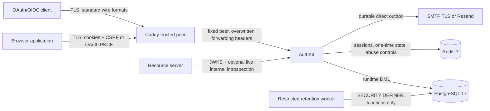
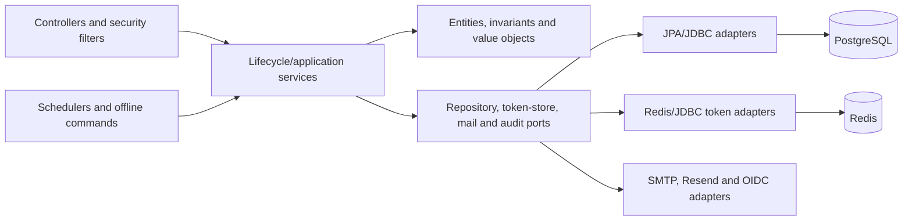
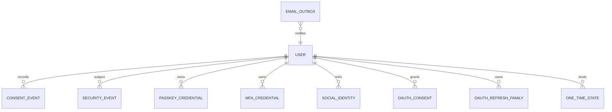
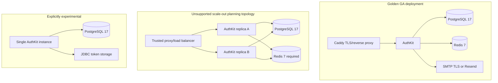
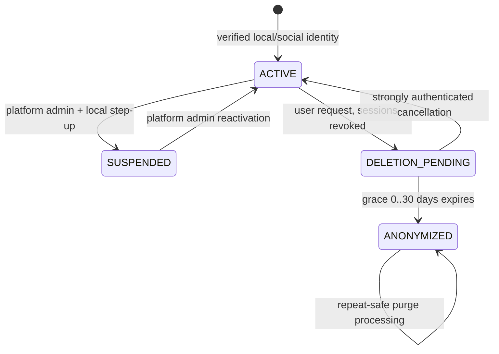
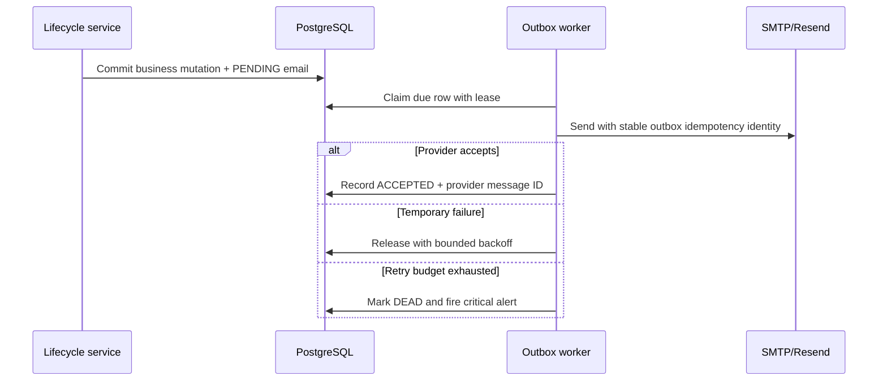
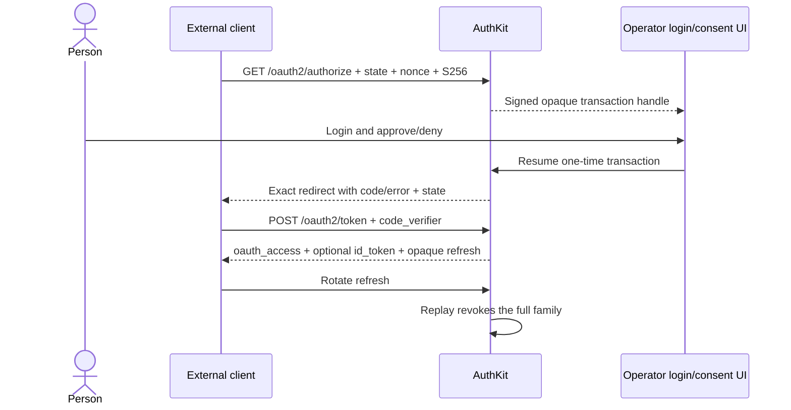
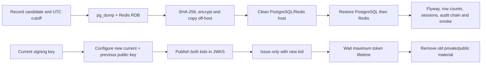

# AuthKit v0.1 system design

[English](SYSTEM_DESIGN.md) | [Português (Brasil)](SYSTEM_DESIGN-ptBR.md)

English is authoritative when translations differ.

## Trust and data boundaries



The browser never receives provider tokens after federation. First-party refresh tokens are HttpOnly same-site cookies protected by double-submit CSRF; access tokens are short-lived and memory-only. Cross-site OAuth clients use Authorization Code with state, nonce, exact redirect URI, and PKCE S256. OAuth refresh tokens are opaque rotating credentials tied to a locked family. `tenant_id` partitions one person's records and carries no organization authority.

## Internal dependency direction



Transport code does not call persistence adapters directly. Services own transaction boundaries; critical audit and SQL business state share the same transaction, while non-transactional revocation/cache cleanup is registered only after commit. Domain code does not depend on Spring MVC, Redis, SMTP or provider wire formats.

## Data ownership



PostgreSQL is authoritative for users, lifecycle state, consents, OAuth families, WebAuthn counters, durable email, and audit. Redis owns expiring first-party sessions, distributed abuse/lockout state, and selected one-time claims; its keys carry user/tenant binding and TTL. Provider tokens are validated and discarded rather than persisted.

## Deployment variants



The golden Compose topology is the fresh-install reference. Same-site browser and cross-site OAuth layouts differ in cookie/CORS behavior, not in trust of forwarded headers. JDBC token storage is restricted to one application instance and is never substituted when a gate requires real Redis.

## Identity lifecycle



Anonymization is irreversible. Security/consent retention is bounded and append-only to the runtime role; deletion is available only to the separate retention role through audited procedures. The last active platform administrator is protected by service logic and a serialized PostgreSQL trigger.

## One-time and transactional boundaries

Registration confirmation and email-change tokens lock the owning user row. Recovery claims use atomic Redis Lua or locked JDBC state with finalize/release compensation. OAuth authorization transactions, codes, social state, nonce, PKCE verifiers, refresh rotation, and passkey counters are conditionally consumed or monotonically updated. Critical audit writes participate synchronously in the business transaction; failure aborts the mutation.

Email creation and business state commit with the durable outbox. Provider dispatch is outside that database transaction: SMTP performs one transport attempt per claim and the outbox owns retries; Resend adds bounded provider-idempotent retries. Provider acceptance and inbox delivery are distinct facts.



## Token classes and revocation

| Class | `token_use` | Audience | Revocation |
| --- | --- | --- | --- |
| First-party access | `first_party_access` | configured API | live session/JTI plus uncached PostgreSQL `session_version`; external offline consumers bounded by ≤300 s expiry |
| OAuth access | `oauth_access` | OAuth client | client/family/JTI revocation and authenticated introspection |
| OIDC ID token | `id_token` | OAuth client | authentication statement only; never accepted as API bearer |

Missing or mismatched `token_use`, issuer, audience, signature, expiry, revoked/unknown `kid`, or token-class claims are rejected. JWKS publishes current and configured retiring public keys, never private material.

The complete endpoint contract is [OpenAPI](../openapi.yaml); operator duties and failure behavior are in [Operations](../OPERATIONS.md).

## Primary use cases

### First-party account and session

```mermaid
sequenceDiagram
  actor Person
  participant App as Same-site application
  participant AK as AuthKit
  participant PG as PostgreSQL
  participant R as Redis
  Person->>App: Register with accepted policy versions
  App->>AK: POST /api/v1/auth/register
  AK->>PG: User + consent + durable email outbox (one transaction)
  Person->>App: Open operator action_url fragment
  App->>AK: POST confirmation token in JSON body
  AK->>PG: Lock user, consume once, audit
  App->>AK: Login
  AK->>R: Create revocable rotating session
  AK-->>App: Access token in response; refresh/CSRF cookies
  App->>AK: Refresh with cookies + CSRF header
  AK->>R: Atomic rotation; replay revokes session
```

### Federation without email auto-link

```mermaid
sequenceDiagram
  actor Person
  participant UI as Operator UI
  participant AK as AuthKit
  participant IdP as Allowlisted OIDC provider
  UI->>AK: Start with providerKey
  AK-->>UI: Provider URL; server keeps state/nonce/PKCE
  UI->>IdP: Authenticate
  IdP->>AK: Exact callback with state + code
  AK->>IdP: Code exchange and signed ID-token validation
  AK->>AK: Resolve only by exact (issuer, subject)
  alt Existing identity
    AK-->>UI: First-party session
  else Matching email only
    AK-->>UI: Explicit link required; no automatic link
  end
  AK->>AK: Discard provider access/refresh/ID tokens
```

### OAuth/OIDC authorization



### Administrative lifecycle and retention

```mermaid
sequenceDiagram
  actor Admin as PLATFORM_ADMIN
  participant AK as AuthKit
  participant PG as PostgreSQL
  participant RW as Retention worker
  Admin->>AK: Mutation + recent local password/MFA step-up
  AK->>PG: Lock target and last-admin guard
  AK->>PG: State mutation + critical audit in one transaction
  Note over AK,PG: Audit failure rolls back the mutation
  RW->>PG: Scoped SECURITY DEFINER purge function
  PG->>PG: Retention outcome appended; direct DELETE denied
```

All administrative searches use short-lived signed cursors bound to the query. Bootstrap of the first administrator is an offline one-shot command; it is not exposed through HTTP.

## Backup, restore and signing-key rotation



Backup/restore is a clean-host exercise, not merely a dump command; checksums, encryption, Redis expiry behavior, Flyway state, audit integrity and application smoke are verified. Planned rotation publishes overlap before issuance changes. Emergency revocation removes the compromised `kid`, invalidates affected live state, and accepts the bounded availability impact; an unknown or revoked `kid` always fails closed. Procedures and evidence fields are in [Operations](../OPERATIONS.md) and the [proof playbook](../proof/README.md).
